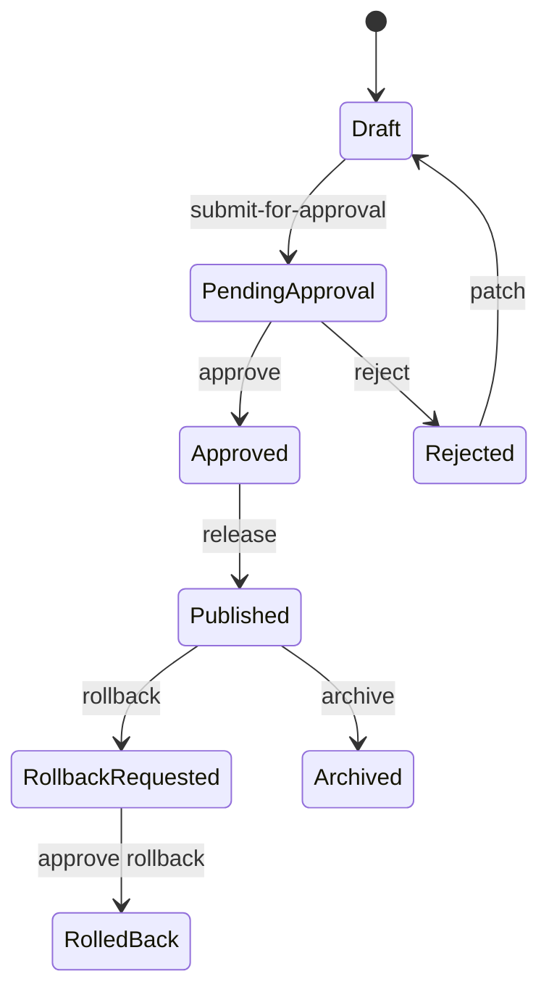
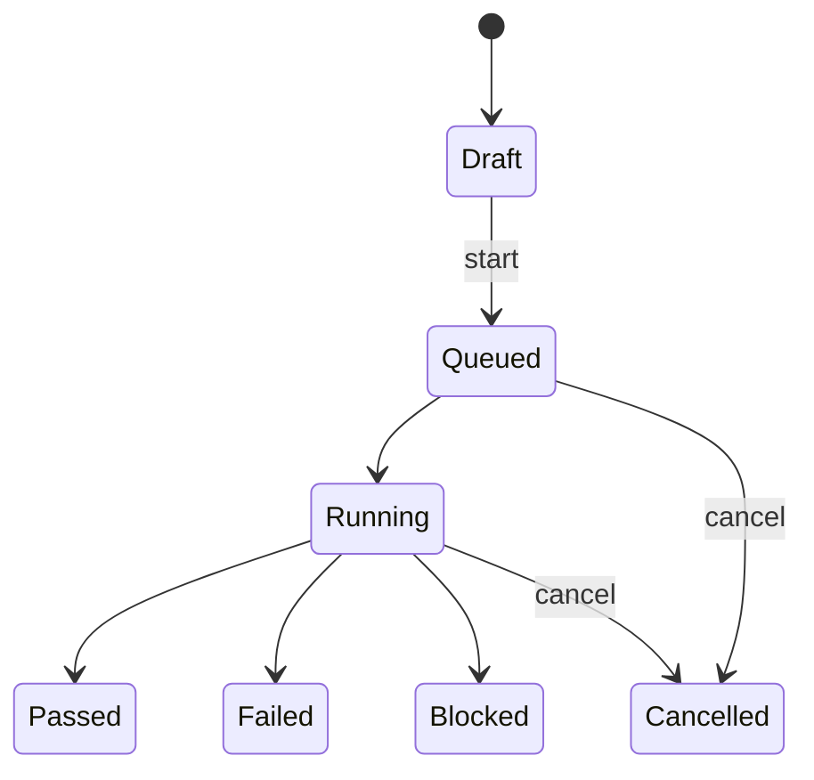

# Data Agent Console API 设计说明

## 1. 设计目标

本文定义 Data Agent Console 后端 API 契约，用于承接 `docs/product/` 下的产品设计和前端 MVP。

API 的定位是配置、运营、观测、评测、发布和审计两个 Agent 产品：

- `Data Governance Agent Runtime`：负责 Policy、DataTool、SQL Gateway、DLP / Masking、Audit、Plan Mode、Connector、Memory / Compaction、安全红队和治理任务执行的安全运行时配置。
- `Data&QA Agent Product`：负责问数 Agent、语义层、澄清、分析工作流、回答模板、Case / Eval、反馈和产品发布配置。

核心边界：

- Console API 不提供 Data&QA 直连数据库能力。
- Data&QA Product 侧只能引用 Runtime 已治理对象，例如 `runtime_environment_id`、`runtime_release_id`、`runtime_data_source_ids`、`runtime_data_tool_ids`、`runtime_policy_ids`。
- SQL 执行、DataTool 调用、DLP、Masking 和 Audit 仍由 Runtime 执行链路负责。
- API 首版以 mock / config store 为目标，不要求接真实后端。

## 2. API 分层

| API 分组 | 路径前缀 | 职责 |
|---|---|---|
| Runtime Resources | `/api/v1/runtime/{resource}` | Runtime 配置对象 CRUD |
| Runtime Approvals | `/api/v1/runtime/{resource}/{id}/submit-for-approval` 等 | 高风险 Runtime 配置审批与回滚 |
| Runtime Audit | `/api/v1/runtime/audit-events` | 审计事件查询，只读 |
| Product Resources | `/api/v1/product/{resource}` | Data&QA 产品配置对象 CRUD |
| Product Approvals | `/api/v1/product/{resource}/{id}/submit-for-approval` 等 | 高风险产品配置审批与回滚 |
| Eval Runs | `/api/v1/product/eval-runs/{id}/start` | 评测运行启动、取消和观测 |
| Feedback | `/api/v1/product/feedback-items/{id}/triage` | 用户反馈分诊、转 Case |

## 3. Runtime 资源覆盖

| 资源 | 路径资源名 | 写入模式 | 风险说明 |
|---|---|---|---|
| Tenant | `tenants` | CRUD | 租户边界变更通常需要平台管理员 |
| Environment | `environments` | CRUD + approval + rollback | prod 环境、真实数据范围属于高风险 |
| Connector | `connectors` | CRUD + approval + rollback | 启用真实 Connector 必须审批 |
| DataSource | `data-sources` | CRUD + approval + rollback | 生产数据源、资产范围、`secret_ref` 变更必须审批 |
| DataTool | `data-tools` | CRUD + approval + rollback | 工具风险等级、Plan Mode、模型上下文权限变更必须审批 |
| ToolPolicy | `tool-policies` | CRUD + approval + rollback | ALLOW 放宽、DENY 降级必须审批 |
| SQLGatewayPolicy | `sql-gateway-policies` | CRUD + approval + rollback | 放宽 SQL 拦截、提升扫描量必须审批 |
| DLPPolicy | `dlp-policies` | CRUD + approval + rollback | 降低敏感等级、允许进模型上下文必须审批 |
| MaskingRule | `masking-rules` | CRUD + approval + rollback | 取消脱敏、可逆脱敏配置必须审批 |
| ApprovalPolicy | `approval-policies` | CRUD + approval + rollback | 审批人、审批门槛、SLA 变更必须审批 |
| AuditEvent | `audit-events` | Read only | 只读审计，不允许业务 API 修改 |
| RuntimeRelease | `runtime-releases` | CRUD + approval + rollback | 发布、回滚必须审计 |

## 4. Data&QA Product 资源覆盖

| 资源 | 路径资源名 | 写入模式 | 风险说明 |
|---|---|---|---|
| AgentApp | `agent-apps` | CRUD + approval + rollback | 绑定 Runtime、工具集、发布状态变更必须审批 |
| AgentProfile | `agent-profiles` | CRUD + approval + rollback | 目标用户、语气、安全说明影响产品体验 |
| SemanticMetric | `semantic-metrics` | CRUD + approval + rollback | 指标口径变更必须评测 |
| SemanticDimension | `semantic-dimensions` | CRUD + approval + rollback | 维度和枚举变更影响查询解释 |
| BusinessEntity | `business-entities` | CRUD + approval + rollback | 业务域与数据源绑定影响权限边界 |
| ClarificationTemplate | `clarification-templates` | CRUD + approval + rollback | 澄清缺失会导致先执行后对口径 |
| AnalysisWorkflow | `analysis-workflows` | CRUD + approval + rollback | 工作流必须经过 Runtime 执行工具 |
| AnswerTemplate | `answer-templates` | CRUD + approval + rollback | 答案模板不能泄露绕权或脱敏规则 |
| CaseItem | `case-items` | CRUD + approval + rollback | 生产门禁 Case 必须发布后才能参与上线门禁 |
| EvalRun | `eval-runs` | CRUD + start / cancel | 运行型对象，不走发布审批，但结果影响发布门禁 |
| FeedbackItem | `feedback-items` | CRUD + triage | 可转 Bad Case 或 Regression Case |
| ProductRelease | `product-releases` | CRUD + approval + rollback | 生产发布必须 Eval、红队和审批通过 |

## 5. 通用写入字段

所有写操作，包括资源新增、资源更新、提交审批、审批通过、审批拒绝、回滚、Eval 启动 / 取消和反馈分诊，都必须支持并校验以下字段：

| 字段 | 必填 | 说明 |
|---|---|---|
| `version` | 是 | 客户端可见配置版本，用于草稿、发布和乐观锁 |
| `created_by` | 创建时必填 | 创建人或服务账号 |
| `updated_by` | 是 | 最近修改人或服务账号 |
| `approval_status` | 是 | `not_required` / `draft` / `pending_approval` / `approved` / `rejected` / `rollback_requested` / `rolled_back` |

更新 API 建议使用 `If-Match-Version` 请求头做乐观锁。版本不一致返回 `VERSION_CONFLICT`。

## 6. 高风险配置动作

高风险配置统一使用以下动作 API：

| 动作 | Runtime 路径 | Product 路径 | 说明 |
|---|---|---|---|
| 提交审批 | `POST /runtime/{resource}/{id}/submit-for-approval` | `POST /product/{resource}/{id}/submit-for-approval` | 草稿进入 `pending_approval` |
| 审批通过 | `POST /runtime/{resource}/{id}/approve` | `POST /product/{resource}/{id}/approve` | 进入 `approved`，可进入发布 |
| 审批拒绝 | `POST /runtime/{resource}/{id}/reject` | `POST /product/{resource}/{id}/reject` | 进入 `rejected`，需要修改后重提 |
| 回滚 | `POST /runtime/{resource}/{id}/rollback` | `POST /product/{resource}/{id}/rollback` | 创建回滚申请，默认仍需审批 |

高风险资源包括：

- Runtime：`environments`、`connectors`、`data-sources`、`data-tools`、`tool-policies`、`sql-gateway-policies`、`dlp-policies`、`masking-rules`、`approval-policies`、`runtime-releases`。
- Data&QA Product：`agent-apps`、`agent-profiles`、`semantic-metrics`、`semantic-dimensions`、`business-entities`、`clarification-templates`、`analysis-workflows`、`answer-templates`、`case-items`、`product-releases`。

## 7. Secret 与敏感数据规则

API 明确禁止传输或保存以下字段：

- `password`
- `token`
- `access_key_secret`
- `private_key`
- `client_secret`
- `connection_password`
- `raw_secret`
- 任何明文数据库连接密码、API Token、AK/SK Secret、私钥正文

允许字段：

- `secret_ref`

`secret_ref` 只表示企业密钥管理系统中的引用，例如：

```json
{
  "secret_ref": "secret://prod/starrocks/rma_readonly"
}
```

后端必须对请求体做敏感字段扫描。命中明文字段时返回：

```json
{
  "error": {
    "code": "SECRET_PLAINTEXT_FORBIDDEN",
    "message": "Plaintext secret fields are forbidden. Use secret_ref."
  },
  "trace_id": "trace_xxx",
  "audit_refs": ["audit_xxx"]
}
```

## 8. 权限模型

API 权限采用 RBAC + ABAC + 审批状态共同裁决。

### 8.1 角色建议

| 角色 | 主要权限 |
|---|---|
| `platform_admin` | 管理 Tenant、Environment、Connector、系统设置 |
| `runtime_admin` | 管理 Runtime 配置、DataTool、Policy、SQL Gateway |
| `data_governance_owner` | 管理数据域、策略、DLP、审批和治理任务 |
| `security_reviewer` | 查看审计、审批高风险变更、运行红队 |
| `data_product_manager` | 管理 AgentApp、语义层、澄清、模板、产品发布 |
| `data_analyst` | 管理指标、维度、Case、Eval、Bad Case |
| `release_manager` | 创建发布单、查看门禁、执行发布和回滚 |
| `viewer` | 只读查看已授权资源 |

### 8.2 ABAC 条件

| 条件 | 示例 |
|---|---|
| `tenant_id` | 用户只能访问所属租户 |
| `environment_id` | 生产环境写入权限单独授予 |
| `business_domain_ids` | RMA 负责人只能修改 RMA 语义层 |
| `resource_type` | 安全人员可管理 DLP 和 Audit，但不一定能改 Agent 产品 |
| `risk_level` | G4/G5 必须审批或拒绝 |
| `approval_status` | 只有草稿可编辑，审批中禁止直接 patch |

### 8.3 默认裁决

- 无匹配权限：`PERMISSION_DENIED`。
- 无匹配策略：默认拒绝。
- 高风险变更无审批：`APPROVAL_REQUIRED`。
- Data&QA 请求携带直连数据库信息：`RUNTIME_BOUNDARY_VIOLATION` 或 `SECRET_PLAINTEXT_FORBIDDEN`。

## 9. 错误码设计

| HTTP 状态 | 错误码 | 场景 |
|---|---|---|
| 400 | `VALIDATION_ERROR` | 参数缺失、枚举非法、必填字段缺失 |
| 400 | `SECRET_PLAINTEXT_FORBIDDEN` | 请求体包含明文 secret |
| 400 | `RUNTIME_BOUNDARY_VIOLATION` | Data&QA 试图直连数据库或绕过 Runtime |
| 401 | `AUTHENTICATION_REQUIRED` | 未登录或 Token 无效 |
| 403 | `PERMISSION_DENIED` | RBAC / ABAC 不允许 |
| 403 | `POLICY_DENIED` | Runtime Policy 返回 DENY |
| 404 | `RESOURCE_NOT_FOUND` | 对象不存在或无权查看 |
| 409 | `VERSION_CONFLICT` | `If-Match-Version` 或请求 `version` 过期 |
| 409 | `APPROVAL_STATE_INVALID` | 非法审批状态流转 |
| 412 | `APPROVAL_REQUIRED` | 高风险操作缺少审批 |
| 422 | `RELEASE_GATE_FAILED` | Eval、红队、Policy 回归或 SQL 回归未通过 |
| 422 | `ROLLBACK_NOT_AVAILABLE` | 目标版本不可回滚 |
| 429 | `RATE_LIMITED` | 请求频率过高 |
| 500 | `INTERNAL_ERROR` | 未分类服务端错误 |

所有错误响应必须包含：

- `trace_id`
- `audit_refs`
- `error.code`
- `error.message`
- `error.details`

## 10. 状态流转

### 10.1 配置对象状态



### 10.2 Eval Run 状态



## 11. 示例请求

### 11.1 创建 StarRocks 只读数据源

```http
POST /api/v1/runtime/data-sources
Content-Type: application/json
```

```json
{
  "id": "ds_starrocks_rma_ads_prod",
  "resource_type": "data-sources",
  "tenant_id": "tenant_loctek",
  "environment_id": "prod",
  "name": "StarRocks RMA ADS 只读源",
  "status": "draft",
  "version": "2026.06.03-draft.1",
  "created_by": "user_platform_admin",
  "updated_by": "user_platform_admin",
  "approval_status": "draft",
  "risk_level": "G3",
  "connector_id": "conn_starrocks_prod",
  "source_type": "warehouse",
  "engine": "starrocks",
  "access_mode": "read_only",
  "secret_ref": "secret://prod/starrocks/rma_readonly",
  "allowed_asset_patterns": ["ads_rma_*", "dws_rma_*"],
  "blocked_asset_patterns": ["ods_*"]
}
```

### 11.2 Data&QA Agent 绑定 Runtime

```http
POST /api/v1/product/agent-apps
Content-Type: application/json
```

```json
{
  "id": "agent_rma_data_qa",
  "resource_type": "agent-apps",
  "tenant_id": "tenant_loctek",
  "name": "RMA 问数助手",
  "status": "draft",
  "version": "2026.06.03-draft.1",
  "created_by": "user_data_pm",
  "updated_by": "user_data_pm",
  "approval_status": "draft",
  "risk_level": "G2",
  "runtime_environment_id": "prod",
  "runtime_release_id": "runtime-release-2026.06.03",
  "runtime_data_source_ids": ["ds_starrocks_rma_ads_prod"],
  "runtime_data_tool_ids": ["tool_query_rma_metric_sql"],
  "business_domain_ids": ["rma_after_sales"]
}
```

### 11.3 提交高风险 SQL Gateway 策略审批

```http
POST /api/v1/runtime/sql-gateway-policies/sql_policy_large_scan/submit-for-approval
Content-Type: application/json
```

```json
{
  "submitted_by": "user_governance_owner",
  "version": "2026.06.03-draft.2",
  "reason": "调整大扫描量阈值，需发布前回归验证",
  "risk_level": "G4",
  "change_summary": "max_scan_bytes 从 1GB 调整到 3GB",
  "rollback_plan": "回滚到 2026.06.01 stable policy",
  "approver_group_id": "security_reviewers",
  "evidence_refs": ["eval_run_sql_gateway_regression_20260603"]
}
```

## 12. 后续实现建议

1. 先实现 mock config store，字段按 `openapi.yaml` 校验。
2. 再接入真实认证和权限系统，至少支持 `tenant_id`、角色、环境、业务域四类裁决。
3. Runtime 和 Data&QA Product 的发布 API 应在下一阶段单独展开，明确发布单、门禁、灰度和回滚证据。
4. OpenAPI 中的通用 resource schema 后续可逐步拆成强类型 schema，例如 `Connector`、`SQLGatewayPolicy`、`AgentApp`、`EvalRun`。
