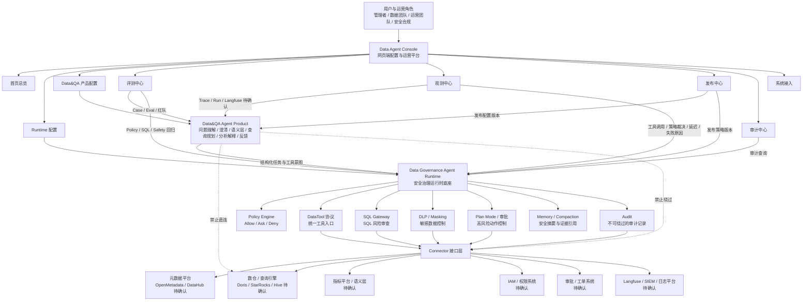

# Data Agent Console 网页端配置平台：阶段 0 产品定位

## 1. 背景与定位

Data Agent Console 是面向企业数据平台、数据治理团队和业务管理者的网页端配置与运营平台，用于统一管理两个 Agent 产品：

- `Data Governance Agent Runtime`：企业级安全治理运行时底座，负责判断 Agent 能不能安全地做、是否需要审批、是否必须拒绝，以及执行过程是否可审计、可回放、可评测。
- `Data&QA Agent Product`：上层数据问答与分析产品，负责理解用户想问什么、是否需要澄清、如何对齐指标口径、如何组织分析解释和业务建议。

Console 不是单纯聊天窗口，也不是一个直接连库的 BI 查询页。它是两个 Agent 产品的配置中心、运营中心、观测中心、评测中心、发布中心和审计中心。

核心定位：

> 用配置化、可审计、可评测的方式，把企业数据 Agent 从“能回答问题”推进到“能被安全运营、持续改进、可控发布”。

## 2. 产品原则

1. Runtime 负责“能不能安全地做”。
2. Data&QA Product 负责“用户想问什么、怎么解释清楚”。
3. Data&QA Product 不能绕过 Runtime 直接访问数据库、调度器、权限系统或外部治理系统。
4. 所有工具调用必须通过 DataTool 协议，并经过 Policy Engine、SQL Gateway、DLP / Masking 和 Audit。
5. 高风险操作必须进入 Plan Mode、审批和审计链路。
6. 指标、维度、枚举、权限、工具路由、发布策略和评测 Case 应优先配置化，不写死在业务代码中。
7. 缺少企业级系统接入信息时标注 `待确认`，不假设已经具备 IAM、SSO、DLP、SIEM、审批、工单或生产数据库权限。
8. Console 的设计顺序为：产品设计文档 -> 前端原型 -> API 契约 -> 集成实现。

## 3. 目标用户

| 用户角色 | 核心诉求 | Console 需要支持的能力 |
|---|---|---|
| 数据平台负责人 | 知道 Agent 是否安全可控、是否具备发布条件 | 总览、发布状态、风险指标、审计趋势、评测通过率 |
| 数据治理负责人 | 管理治理规则、策略、审批、审计和治理任务执行 | Policy 配置、Plan Mode、治理任务、审计查询 |
| 数据产品经理 | 配置 Data&QA 产品能力、管理指标口径和用户体验 | 场景配置、语义层、澄清策略、反馈闭环 |
| 数据开发 / 数仓工程师 | 确认 SQL、指标、表、字段、工具路由是否正确 | SQL Gateway、DataTool、Connector、元数据映射 |
| 数据分析师 | 维护问答 Case、解释模板和分析口径 | Case 数据集、评测、问题分类、结果解释规则 |
| 安全 / 合规人员 | 确认敏感数据、权限、审计、红队测试是否达标 | DLP、权限策略、审计留痕、安全红队与回归报告 |
| 业务管理者 | 看到 Agent 能解决哪些经营问题，输出是否可信 | 产品体验、问答质量、业务建议、反馈入口 |

## 4. 核心场景

### 4.1 Runtime 配置与治理运营

- 配置 Policy Rule：Allow / Ask / Deny、风险等级、角色、资产类型、敏感等级、工具范围。
- 配置 DataTool：工具名称、输入输出模型、只读属性、审批要求、最大返回行数、是否允许进入模型上下文。
- 配置 SQL Gateway：SQL 风险规则、默认 LIMIT、敏感字段、禁止 DDL / DML、原始层访问策略。
- 配置 DLP / Masking：敏感等级、字段识别规则、脱敏策略、结果返回边界。
- 配置 Plan Mode：风险等级、审批人、回滚计划要求、审批后允许执行的工具。
- 配置 Connector：OpenMetadata、数仓、指标平台、权限系统、DLP、工单、调度、Langfuse 等连接器的启用状态和 mock / real 状态。
- 查看 Audit：工具调用、策略裁决、SQL 审查、脱敏、审批、任务执行的审计事件。
- 运营治理任务：数据质量、指标治理、敏感数据识别、权限巡检、血缘影响、治理报告。
- 运行安全红队测试：提示词注入、越权查询、绕过脱敏、关闭审计、`SELECT *`、大结果集、原始层访问等反向 Case。

### 4.2 Data&QA Product 配置与产品运营

- 配置用户问题分类：指标查询、指标解释、知识库问答、异常诊断、归因分析、业务建议。
- 配置主动澄清规则：时间范围缺失、指标口径不清、维度冲突、业务域不明确、数据粒度不匹配。
- 配置语义层：指标、维度、枚举、时间口径、默认过滤条件、业务术语和别名。
- 配置查询规划：从用户问题到结构化任务、工具调用计划、风险等级和执行路径。
- 配置结果解释：指标解释模板、异常说明、可信度提示、数据限制说明、业务建议边界。
- 管理用户反馈：好评、差评、纠错、Bad Case、人工复核状态。
- 管理 Case 数据集：黄金 Case、反向 Case、回归 Case、线上 Bad Case。
- 管理 Langfuse 观测与评测：Trace、Session、Run、Latency、Cost、评分、失败原因。
- 管理产品体验：面向管理者、数据团队、运营团队的入口、权限和交互流程。

### 4.3 发布与变更管理

- 配置变更草稿：策略、工具、语义层、Case、Prompt / 模板、Connector 参数。
- 变更影响分析：影响哪些 Agent、工具、场景、Case、角色和资产。
- 发布前检查：Policy 回归、SQL Gateway 回归、Data&QA Case 回归、安全红队回归。
- 灰度发布：按环境、用户组、业务域、Agent 产品维度发布。
- 回滚：保留上一个稳定版本，发布失败或评测不达标时回退。

## 5. 非目标范围

阶段 0 不做以下内容：

- 不开发前端页面和业务代码。
- 不实现真实数据库连接或真实 SQL 执行。
- 不实现真实审批、工单、IAM、SSO、DLP、SIEM 或 Langfuse 集成。
- 不把 Console 设计成独立聊天机器人。
- 不让 Data&QA Product 直接访问数据库、表、字段或生产连接。
- 不把指标、权限、枚举、工具路由写死到 Agent Prompt 中。
- 不提供自动生产变更能力。
- 不替代企业已有 BI、指标平台、元数据平台、权限平台或审计平台。

## 6. Runtime 与 Data&QA Product 职责边界

| 边界项 | Data Governance Agent Runtime | Data&QA Agent Product |
|---|---|---|
| 产品定位 | 安全治理运行时底座 | 数据问答与分析体验产品 |
| 核心问题 | 能不能安全地做 | 用户到底想问什么，如何解释清楚 |
| 数据访问 | 通过 DataTool、Policy、SQL Gateway、DLP、Audit 控制 | 只能提交结构化任务和工具意图，不能直连数据库 |
| 权限策略 | 负责 Allow / Ask / Deny 和默认拒绝 | 读取策略结果，向用户解释限制和下一步 |
| SQL 控制 | 审查 SQL 风险、重写、阻断或要求审批 | 生成查询意图和计划，不绕过 SQL Gateway |
| 敏感数据 | 分级、脱敏、禁止进入模型上下文 | 展示脱敏后结果和安全说明 |
| 高风险动作 | 进入 Plan Mode、审批、审计 | 触发计划申请，展示审批状态和原因 |
| 工具协议 | 定义和执行 DataTool | 选择需要调用的工具意图 |
| Memory / Compaction | 只保存安全摘要、证据引用和裁决 | 使用可召回的安全摘要改善问答体验 |
| Audit | 记录任务、工具、策略、SQL、脱敏、审批 | 展示 Trace 摘要、用户反馈和产品质量指标 |
| Eval / 红队 | 验证安全拦截、权限、工具边界 | 验证问答质量、口径对齐、解释和建议 |
| 发布门禁 | 提供安全回归和策略回归结果 | 提供产品 Case 回归和体验评估结果 |

硬边界：

- Data&QA Product 的任何数据查询、元数据查询、指标查询、治理执行都必须通过 Runtime。
- Runtime 的 `DENY` 不允许被 Data&QA Product 改写为执行。
- Runtime 的 `ASK` 必须进入 Plan Mode 或审批状态，不允许由前端直接跳过。
- L3 / L4 / L5 敏感数据、原始明细、密钥、Token、密码、个人信息不得进入模型上下文、Memory 或审计原文。

## 7. 网页端平台一级模块

| 一级模块 | 主要对象 | 阶段 0 设计意图 |
|---|---|---|
| 首页总览 | 产品状态、风险概览、发布版本、评测通过率、审计告警 | 给管理者和平台负责人一个可运营视角 |
| Runtime 配置 | Policy、DataTool、SQL Gateway、DLP、Plan Mode、Connector、Memory | 统一配置“能不能安全地做”的规则 |
| Data&QA 产品配置 | 场景、语义层、澄清、查询规划、解释模板、用户反馈 | 统一配置“怎么问、怎么解释、怎么改进” |
| Agent 编排与任务 | 治理任务、问答任务、执行计划、状态、证据引用 | 管理 Agent 执行过程，而不是只看最终答案 |
| 观测中心 | Trace、Run、Latency、Cost、工具调用、失败原因、Langfuse | 让线上运行质量可追踪 |
| 评测中心 | Case 数据集、回归结果、安全红队、Bad Case、评分规则 | 让发布前后的质量可量化 |
| 发布中心 | 草稿、版本、影响分析、灰度、回滚、发布门禁 | 把配置变更纳入产品发布流程 |
| 审计中心 | 审计事件、策略裁决、SQL 审查、脱敏记录、审批记录 | 支撑合规复盘和责任追踪 |
| 系统接入 | OpenMetadata、数仓、指标平台、权限、DLP、工单、调度、SIEM | 管理外部系统连接边界和启用状态 |
| 权限与组织 | 用户、角色、业务域、环境、审批人、数据资产范围 | 支撑最小权限和职责分离 |

## 8. MVP 范围

阶段 0 只输出产品定位与信息架构。后续 MVP 建议控制在以下范围内：

### 8.1 Runtime Console MVP

- Policy Rule 列表、详情、启用 / 禁用草稿。
- DataTool 注册表视图。
- SQL Gateway 风险规则视图。
- Plan Mode 计划与审批状态视图。
- Audit 事件查询视图。
- Connector mock / stub 状态视图。
- 安全红队 Case 结果视图。

### 8.2 Data&QA Console MVP

- 问答场景配置：指标查询、指标解释、知识库问答。
- 语义层配置：指标、维度、时间口径、枚举和别名。
- 主动澄清规则配置。
- Case 数据集管理：黄金 Case、反向 Case、Bad Case。
- 运行记录与反馈闭环。
- Langfuse Trace 占位视图，真实接入状态标注 `待确认`。

### 8.3 发布 MVP

- 配置草稿。
- 发布前检查清单。
- 回归评测结果。
- 版本记录。
- 回滚入口。

## 9. Mermaid 架构图

## 10. 设计理由

- 先把 Console 定位成配置与运营平台，避免把产品收窄成聊天 UI。
- 以 Runtime 为强制安全边界，符合当前项目已有的 Policy、DataTool、SQL Gateway、DLP、Audit、Plan Mode 设计。
- 把 Data&QA Product 独立成上层产品能力，便于沉淀问题理解、主动澄清、语义层、解释、反馈和 Case。
- 把 Eval、Audit、Observe、Release 独立成一级模块，避免 Agent 只在研发阶段可测试、上线后不可运营。
- 把 Connector 作为系统接入层，保留 mock / stub 状态，避免阶段 0 假设已经具备真实企业系统连接。

## 11. 阶段 0 风险与待确认

| 风险 / 待确认项 | 影响 | 建议处理 |
|---|---|---|
| IAM / SSO / 组织角色 `待确认` | 无法最终确定 Console 权限模型 | 阶段 1 输出角色权限矩阵和登录态假设 |
| 审批 / 工单系统 `待确认` | Plan Mode 只能停留在 mock 审批 | 阶段 3 API 契约中定义审批回调接口 |
| 真实数仓和元数据平台接入 `待确认` | Connector 只能先展示状态和接口定义 | 阶段 3 定义 Connector API 和健康检查 |
| Langfuse / SIEM / 日志平台 `待确认` | 观测中心无法直接落真实数据 | 先设计 Trace 数据模型和占位视图 |
| 指标平台和语义层归属 `待确认` | Data&QA 语义配置可能与现有指标平台重复 | 阶段 1 梳理对象归属和同步方式 |
| 发布门禁规则未定 | 配置可能绕过评测直接上线 | 阶段 2 原型中加入发布前检查和回归结果 |

## 12. 后续阶段建议

1. 阶段 1：前端信息架构与页面清单
   - 输出 Console 导航结构、页面列表、核心对象、关键状态和角色权限矩阵。
   - 不写代码，只做低保真产品结构。

2. 阶段 2：前端高保真原型
   - 基于阶段 1 输出可交互网页原型。
   - 覆盖首页总览、Runtime 配置、Data&QA 配置、评测中心、发布中心、审计中心。

3. 阶段 3：API 契约
   - 输出前端需要的 API、请求响应结构、状态码、权限边界和错误模型。
   - 明确哪些接口来自 Runtime，哪些来自 Data&QA Product，哪些来自 Connector。

4. 阶段 4：集成实现
   - 按 API 契约逐步接入现有 Runtime / Data&QA 代码。
   - 每次只接一个模块，先 mock 数据，再接真实后端。

5. 阶段 5：发布与运营闭环
   - 加入评测门禁、版本管理、灰度、回滚、审计报表和 Bad Case 改进流程。
