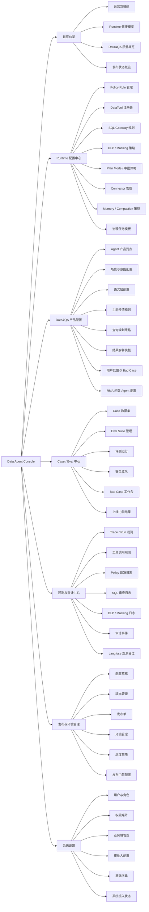

# Data Agent Console 网页端信息架构：阶段 1

## 1. 设计目标

本阶段为 Data Agent Console 建立网页端信息架构，明确一级导航、二级页面、页面对象、关键字段、关键操作和用户路径。

阶段 1 仍不写业务代码、不设计 API 契约、不接真实数据源。所有配置能力均以产品信息架构为准，后续阶段再进入前端原型和 API 设计。

核心边界保持不变：

- Runtime 配置中心负责“能不能安全地做”。
- Data&QA 产品配置负责“用户想问什么、怎么解释清楚”。
- Data&QA Agent 不能绕过 Runtime 直接访问数据库、Connector 或生产系统。
- 高风险配置必须经过草稿、评测、审批、发布和审计。

## 2. 一级导航总览

| 一级导航 | 定位 | 页面模式 |
|---|---|---|
| 首页总览 | 跨 Runtime、Data&QA、Eval、发布、审计的运营驾驶舱 | 只读观测 |
| Runtime 配置中心 | 配置 Policy、DataTool、SQL Gateway、DLP、Plan Mode、Connector、Memory | 新增 / 编辑 / 发布 |
| Data&QA 产品配置 | 配置问答场景、语义层、澄清、查询规划、解释模板、反馈闭环 | 新增 / 编辑 / 发布 |
| Case / Eval 中心 | 管理 Case、运行评测、安全红队、Bad Case 和上线门禁 | 新增 / 编辑 / 运行 / 发布 |
| 观测与审计中心 | 查看 Trace、运行、工具调用、策略裁决、SQL 审查和审计事件 | 只读观测为主 |
| 发布与环境管理 | 管理草稿、版本、环境、灰度、发布门禁和回滚 | 发布 / 回滚 / 只读历史 |
| 系统设置 | 管理组织、角色、审批人、业务域、系统接入和基础字典 | 新增 / 编辑为主 |

## 3. 页面清单与页面定义

### 3.1 首页总览

| 二级页面 | 页面目标 | 目标用户 | 核心配置对象 | 关键操作 | 关键字段 | 页面权限 |
|---|---|---|---|---|---|---|
| 运营驾驶舱 | 查看 Console 整体健康状态 | 平台负责人、数据治理负责人、数据产品经理 | 产品状态、评测结果、发布版本、审计告警 | 筛选环境、筛选时间、跳转详情 | 环境、当前版本、评测通过率、红队通过率、P95 延迟、失败率、待审批数、告警数 | 只读观测 |
| Runtime 健康概览 | 查看 Runtime 安全链路是否正常 | 平台管理员、安全合规、数据治理负责人 | Policy、DataTool、SQL Gateway、DLP、Audit、Connector | 查看详情、跳转异常对象 | 组件状态、最近失败、DENY 数、ASK 数、审计写入状态、Connector 可用性 | 只读观测 |
| Data&QA 质量概览 | 查看问答产品质量和用户反馈 | 数据产品经理、数据分析师、业务管理者 | 场景、Case、反馈、Bad Case、Trace | 筛选场景、跳转 Case、跳转反馈 | 问答成功率、澄清率、转人工率、用户满意度、Bad Case 数、重点业务域 | 只读观测 |
| 发布状态概览 | 查看当前版本和待发布变更 | 平台负责人、发布负责人、数据产品经理 | 草稿、版本、发布单、回滚点 | 查看发布单、跳转发布门禁 | 当前生产版本、预发版本、待发布草稿、阻断项、上次发布时间、发布人 | 只读观测 |

### 3.2 Runtime 配置中心

| 二级页面 | 页面目标 | 目标用户 | 核心配置对象 | 关键操作 | 关键字段 | 页面权限 |
|---|---|---|---|---|---|---|
| Policy Rule 管理 | 配置 Allow / Ask / Deny 策略 | 数据治理负责人、安全合规、平台管理员 | PolicyRule | 新增规则、编辑草稿、启用 / 禁用、复制、提交发布、查看命中记录 | rule_id、名称、effect、priority、角色、工具、操作、资产类型、敏感等级、原因、版本、状态 | 新增 / 编辑 / 发布 |
| DataTool 注册表 | 管理 Agent 可用工具及执行边界 | 平台管理员、前端架构师、数据开发 | DataTool | 新增工具定义、编辑草稿、设置只读、设置审批、查看调用记录 | tool_name、描述、input_model、output_model、is_read_only、is_destructive、requires_approval、allow_in_model_context、max_rows、max_bytes | 新增 / 编辑 / 发布 |
| SQL Gateway 规则 | 配置 SQL 风险识别和执行门禁 | 数据开发、安全合规、数据治理负责人 | SQLRiskRule | 新增风险规则、编辑裁决、配置默认 LIMIT、发布规则、查看 SQL 审查样例 | risk_type、匹配条件、decision、默认 LIMIT、敏感字段、原始层策略、改写策略、原因 | 新增 / 编辑 / 发布 |
| DLP / Masking 策略 | 配置敏感字段分级和脱敏策略 | 安全合规、数据治理负责人 | SensitivityRule、MaskingRule | 新增敏感字段规则、编辑脱敏方式、发布策略、查看脱敏记录 | 字段名、字段标签、敏感等级、脱敏方式、是否允许进模型上下文、适用业务域、适用角色 | 新增 / 编辑 / 发布 |
| Plan Mode / 审批策略 | 配置高风险动作的计划与审批要求 | 数据治理负责人、平台管理员、安全合规 | GovernancePlanPolicy | 新增审批策略、设置审批人、设置回滚要求、发布策略 | 风险等级、触发条件、required_approvers、rollback_required、allowed_tools_after_approval、超时时间、状态 | 新增 / 编辑 / 发布 |
| Connector 管理 | 管理外部系统连接器状态 | 平台管理员、数据开发 | ConnectorConfig | 新增 Connector 草稿、测试连接、启用 / 禁用、查看调用失败 | connector_kind、名称、环境、enabled、is_mock、timeout_seconds、endpoint、认证方式、健康状态、最近调用 | 新增 / 编辑 / 发布 |
| Memory / Compaction 策略 | 管理记忆和上下文压缩边界 | 平台管理员、数据产品经理、安全合规 | MemoryPolicy、CompactionPolicy | 编辑召回策略、设置过期、设置敏感等级限制、查看召回样例 | memory_type、allow_retrieval、expires_at、last_verified_at、sensitivity_limit、保留字段、禁止字段 | 新增 / 编辑 / 发布 |
| 治理任务模板 | 配置 Runtime 治理任务的模板 | 数据治理负责人、数据开发 | GovernanceTaskTemplate | 新增模板、编辑步骤、绑定工具、发布模板 | task_type、风险等级、步骤链路、默认工具、evidence_refs、required_approvals、输出模板 | 新增 / 编辑 / 发布 |

### 3.3 Data&QA 产品配置

| 二级页面 | 页面目标 | 目标用户 | 核心配置对象 | 关键操作 | 关键字段 | 页面权限 |
|---|---|---|---|---|---|---|
| Agent 产品列表 | 管理不同业务域的问数 Agent | 数据产品经理、平台负责人 | AgentProduct | 新增 Agent、复制配置、编辑草稿、提交发布 | agent_id、名称、业务域、目标用户、启用场景、关联语义层、关联 Runtime 策略、版本、状态 | 新增 / 编辑 / 发布 |
| 场景与意图配置 | 配置用户问题类型和任务分流 | 数据产品经理、数据分析师 | IntentScenario | 新增场景、编辑识别规则、配置风险等级、发布场景 | scenario_id、意图类型、示例问法、关键词、业务域、默认风险等级、可用工具意图 | 新增 / 编辑 / 发布 |
| 语义层配置 | 配置指标、维度、枚举、时间口径 | 数据产品经理、数据分析师、数据开发 | Metric、Dimension、Enum、TimeGrain | 新增指标、编辑口径、维护别名、绑定表字段、发布语义层 | metric_id、名称、业务定义、计算口径、维度、时间口径、枚举值、同义词、来源表、负责人 | 新增 / 编辑 / 发布 |
| 主动澄清规则 | 配置哪些问题必须先澄清 | 数据产品经理、数据分析师 | ClarificationRule | 新增规则、编辑触发条件、配置澄清问题、发布规则 | 缺失项、触发场景、澄清问题、候选项、默认处理、是否阻断执行 | 新增 / 编辑 / 发布 |
| 查询规划策略 | 配置从问题到工具意图的计划 | 数据产品经理、数据开发、平台管理员 | QueryPlanningPolicy | 新增策略、编辑路由、绑定 DataTool、配置风险判断 | 场景、业务域、工具意图、执行顺序、最大步骤数、失败兜底、Runtime 策略引用 | 新增 / 编辑 / 发布 |
| 结果解释模板 | 配置答案结构和解释边界 | 数据产品经理、数据分析师 | AnswerTemplate | 新增模板、编辑说明、配置限制提示、发布模板 | 场景、答案结构、指标解释、数据限制、可信度提示、业务建议边界、禁用表达 | 新增 / 编辑 / 发布 |
| 用户反馈与 Bad Case | 运营用户反馈并沉淀改进项 | 数据产品经理、数据分析师 | FeedbackEvent、BadCase | 标记 Bad Case、分派负责人、关联 Case、关闭问题 | feedback_id、用户问题、答案摘要、评分、问题类型、责任人、处理状态、关联 Trace | 新增 / 编辑 |
| RMA 问数 Agent 配置 | 配置 RMA 领域问数产品能力 | 数据产品经理、数据分析师、数据治理负责人 | RMA Agent 配置包 | 选择业务域、绑定 RMA 指标、配置维度、配置澄清规则、提交评测 | Agent 名称、RMA 指标、售后原因、仓库、市场、品牌、时间口径、权限策略、Case 集 | 新增 / 编辑 / 发布 |

### 3.4 Case / Eval 中心

| 二级页面 | 页面目标 | 目标用户 | 核心配置对象 | 关键操作 | 关键字段 | 页面权限 |
|---|---|---|---|---|---|---|
| Case 数据集 | 管理黄金 Case、反向 Case、Bad Case | 数据分析师、数据产品经理、安全合规 | EvalCase | 新增 Case、编辑 Case、导入、标记类型、提交发布 | case_id、name、user_query、task_type、expected_policy_decision、expected_sql、expected_answer_key_points、must_not_include、tags | 新增 / 编辑 / 发布 |
| Eval Suite 管理 | 管理一组可运行的评测套件 | 数据团队、平台管理员 | EvalSuite | 新增 Suite、选择 Case、配置权重、设置上线阈值 | suite_id、名称、Case 数、适用 Agent、适用环境、最低通过率、安全阈值、版本 | 新增 / 编辑 / 发布 |
| 评测运行 | 运行评测并查看结果 | 数据团队、发布负责人 | EvalRun、EvalReport | 运行评测、重跑失败项、查看详情、导出报告 | run_id、suite、agent_version、env、通过率、失败数、失败原因、耗时、运行人 | 运行 / 只读观测 |
| 安全红队 | 验证越权、脱敏绕过、提示词注入等风险 | 安全合规、数据治理负责人 | SecurityCase、RedTeamRun | 运行红队、查看阻断结果、生成报告 | case_id、攻击类型、expected_decision、observed_decision、是否阻断、敏感词命中、审计引用 | 运行 / 只读观测 |
| Bad Case 工作台 | 把线上失败沉淀为 Case 和修复任务 | 数据产品经理、数据分析师 | BadCase、FixTask | 分派、关联 Trace、转 Case、关闭、复测 | bad_case_id、问题分类、严重等级、来源、责任人、状态、关联 Case、修复版本 | 新增 / 编辑 |
| 上线门禁结果 | 判断 Agent 或配置是否可以发布 | 发布负责人、平台负责人、数据团队 | ReleaseGateResult | 查看门禁、确认阻断项、跳转失败 Case | release_id、Eval 通过率、安全红队结果、Policy 回归、SQL 回归、阻断原因、结论 | 只读观测 |

### 3.5 观测与审计中心

| 二级页面 | 页面目标 | 目标用户 | 核心配置对象 | 关键操作 | 关键字段 | 页面权限 |
|---|---|---|---|---|---|---|
| Trace / Run 观测 | 查看 Agent 每次运行链路 | 数据产品经理、平台管理员、数据团队 | TraceRecord、Run | 筛选、查看详情、关联反馈、关联 Case | trace_id、session_id、task_id、agent、场景、状态、耗时、token / cost 待确认、失败原因 | 只读观测 |
| 工具调用观测 | 查看 DataTool 调用和结果摘要 | 平台管理员、数据开发、安全合规 | ToolCallRecord | 筛选工具、查看策略结果、查看审计引用 | tool_name、user_id、asset_refs、policy_decision、approval_required、result_summary、audit_refs | 只读观测 |
| Policy 裁决日志 | 查看 Allow / Ask / Deny 命中情况 | 数据治理负责人、安全合规 | PolicyDecisionLog | 筛选规则、查看命中原因、跳转规则 | rule_id、decision、reason、role、asset_type、sensitivity_level、task_id、timestamp | 只读观测 |
| SQL 审查日志 | 查看 SQL Gateway 风险识别结果 | 数据开发、安全合规 | SQLReviewLog | 筛选风险、查看改写结果、跳转 Trace | sql_hash、risk_type、decision、rewritten_sql 摘要、required_approval、reason、audit_ref | 只读观测 |
| DLP / Masking 日志 | 查看脱敏和敏感结果拦截 | 安全合规、数据治理负责人 | MaskingLog | 筛选字段、查看脱敏策略、跳转 Trace | 字段名、敏感等级、masking_rule、是否进入模型上下文、result_hash、audit_ref | 只读观测 |
| 审计事件 | 查询不可绕过的审计链路 | 安全合规、审计人员、平台管理员 | AuditEvent | 条件查询、导出摘要、校验链路完整性 | event_id、timestamp、user_id、role、task_id、tool_name、policy_decision、request_hash、result_hash | 只读观测 |
| Langfuse 观测占位 | 预留 Langfuse 运行质量视图 | 数据产品经理、平台管理员 | LangfuseTrace 待确认 | 查看接入状态、跳转配置 | project、trace_id、score、latency、cost、model、接入状态 `待确认` | 只读观测 |

### 3.6 发布与环境管理

| 二级页面 | 页面目标 | 目标用户 | 核心配置对象 | 关键操作 | 关键字段 | 页面权限 |
|---|---|---|---|---|---|---|
| 配置草稿 | 汇总待发布配置变更 | 数据产品经理、平台管理员、数据治理负责人 | DraftChange | 新建草稿、编辑、合并、废弃、提交评测 | draft_id、对象类型、对象名称、变更摘要、影响范围、创建人、状态 | 新增 / 编辑 |
| 版本管理 | 管理 Runtime 和 Data&QA 配置版本 | 发布负责人、平台负责人 | ConfigVersion | 查看版本、对比版本、标记稳定、创建回滚点 | version_id、产品、环境、发布时间、发布人、评测结果、变更摘要 | 发布 / 回滚 / 只读历史 |
| 发布单 | 执行发布流程和审批 | 发布负责人、平台管理员 | ReleaseOrder | 创建发布单、关联草稿、运行门禁、提交审批、发布、回滚 | release_id、环境、目标版本、门禁结果、审批状态、发布状态、回滚版本 | 发布 / 回滚 |
| 环境管理 | 管理 dev / test / staging / prod | 平台管理员 | Environment | 新增环境、编辑环境、设置发布策略、查看状态 | env_id、名称、类型、可发布对象、灰度规则、Connector 状态、数据范围 | 新增 / 编辑 |
| 灰度策略 | 管理按用户组、业务域、环境的灰度 | 发布负责人、平台管理员 | RolloutPolicy | 新增灰度、编辑比例、暂停、全量、回滚 | rollout_id、目标用户组、业务域、比例、开始时间、监控指标、回滚条件 | 新增 / 编辑 / 发布 |
| 发布门禁配置 | 配置发布前必须通过的检查 | 平台负责人、安全合规、发布负责人 | ReleaseGatePolicy | 新增门禁、设置阈值、绑定 Suite、发布门禁 | gate_id、最低通过率、红队要求、审计要求、审批要求、阻断级别 | 新增 / 编辑 / 发布 |

### 3.7 系统设置

| 二级页面 | 页面目标 | 目标用户 | 核心配置对象 | 关键操作 | 关键字段 | 页面权限 |
|---|---|---|---|---|---|---|
| 用户与角色 | 管理 Console 用户角色 | 平台管理员 | User、Role | 新增用户、分配角色、禁用用户 | user_id、姓名、部门、角色、业务域、状态、最近登录 | 新增 / 编辑 |
| 权限矩阵 | 管理页面和对象级权限 | 平台管理员、安全合规 | PermissionMatrix | 编辑权限、按角色预览、发布权限 | role、一级导航、二级页面、对象类型、可读、可编辑、可发布、可审批 | 新增 / 编辑 / 发布 |
| 业务域管理 | 管理业务域和数据责任边界 | 数据治理负责人、平台管理员 | BusinessDomain | 新增业务域、设置负责人、绑定资产范围 | domain_id、名称、负责人、资产范围、适用 Agent、审批人 | 新增 / 编辑 |
| 审批人配置 | 管理 Plan Mode 和发布审批人 | 平台管理员、数据治理负责人 | ApproverConfig | 新增审批组、编辑审批规则、停用 | 审批组、风险等级、业务域、审批人、备份审批人、SLA | 新增 / 编辑 |
| 基础字典 | 管理敏感等级、风险等级、任务类型等枚举 | 平台管理员、数据治理负责人 | DictionaryItem | 新增字典、编辑、停用、发布 | 字典类型、编码、名称、描述、排序、启用状态 | 新增 / 编辑 / 发布 |
| 系统接入状态 | 查看企业系统接入和待确认项 | 平台管理员、数据开发 | IntegrationStatus | 查看状态、编辑备注、跳转 Connector | 系统类型、接入状态、负责人、认证方式、最近检查、待确认项 | 只读观测 / 编辑备注 |

## 4. 三类用户路径

### 4.1 平台管理员：接入一个新数据源并配置安全策略

目标：把一个新数仓或元数据源纳入 Runtime 管控，并确保 Data&QA Agent 只能通过 Runtime 安全访问。

1. 进入 `系统设置 / 业务域管理`
   - 新建或选择业务域。
   - 设置数据负责人、治理负责人、审批人。
   - 标记该业务域是否允许接入 Data&QA Agent。

2. 进入 `发布与环境管理 / 环境管理`
   - 确认数据源要接入的环境，例如 `dev`、`test`、`prod`。
   - 配置该环境是否允许真实 Connector。
   - 生产环境默认要求发布门禁和审批。

3. 进入 `Runtime 配置中心 / Connector 管理`
   - 新建 Connector 草稿。
   - 选择 Connector 类型：metadata、warehouse、metric、permission、masking 等。
   - 填写名称、环境、timeout、mock / real 状态、负责人。
   - 测试连接只返回健康状态和摘要，不展示敏感连接信息。

4. 进入 `Runtime 配置中心 / DLP / Masking 策略`
   - 配置敏感字段识别规则。
   - 设置 L3 / L4 / L5 数据禁止进入模型上下文。
   - 配置字段级脱敏方式和适用角色。

5. 进入 `Runtime 配置中心 / SQL Gateway 规则`
   - 配置新数据源的原始层访问策略。
   - 设置 `SELECT *`、DDL、DML、大结果集、敏感字段、跨域 JOIN 的裁决规则。
   - 设置默认 LIMIT 和必要的 SQL 改写策略。

6. 进入 `Runtime 配置中心 / Policy Rule 管理`
   - 配置角色、业务域、工具、资产类型和敏感等级的 Allow / Ask / Deny。
   - 对高风险访问设置 ASK，对禁止访问设置 DENY。
   - 无匹配规则保持默认拒绝。

7. 进入 `Runtime 配置中心 / Plan Mode / 审批策略`
   - 配置高风险动作的审批人、回滚要求和允许工具白名单。
   - G5 高风险动作保持不可审批通过。

8. 进入 `Case / Eval 中心 / 安全红队`
   - 运行新数据源安全红队 Case。
   - 验证越权查询、绕过脱敏、原始层访问、关闭审计、DDL / DML 均被 DENY 或 ASK。

9. 进入 `发布与环境管理 / 发布单`
   - 关联 Connector、Policy、SQL Gateway、DLP、Plan Mode 草稿。
   - 运行发布门禁。
   - 门禁通过后提交审批并发布。

成功标准：

- 新数据源只能通过 Connector + DataTool 被访问。
- SQL 必须经过 SQL Gateway。
- 敏感数据必须经过 DLP / Masking。
- 高风险操作必须进入 Plan Mode。
- 所有操作都能在审计中心查询到。

### 4.2 数据产品经理：配置一个 RMA 问数 Agent

目标：配置面向 RMA 售后分析场景的 Data&QA 问数 Agent，使业务用户可以安全提问、澄清、查询和解释。

1. 进入 `Data&QA 产品配置 / Agent 产品列表`
   - 新建 `RMA 问数 Agent`。
   - 设置目标用户为管理者、运营团队、数据团队。
   - 绑定业务域：RMA / 售后 / 客诉分析。

2. 进入 `Data&QA 产品配置 / 语义层配置`
   - 配置 RMA 指标，例如客诉量、客诉率、退货量、退货率、问题数量。
   - 配置维度，例如市场、品牌、仓库、问题类型、售后原因、销售渠道、时间。
   - 配置时间口径，例如自然日、自然月、订单日期、RMA 创建日期。
   - 配置枚举和同义词，例如售后原因、质量问题、物流问题、平台渠道。

3. 进入 `Data&QA 产品配置 / 场景与意图配置`
   - 配置 RMA 指标查询、指标解释、异常诊断、归因分析、知识库问答。
   - 设置 L1 指标查询可自动执行，L2+ 诊断类问题按策略升级。
   - 绑定可用工具意图，但不直接绑定数据库连接。

4. 进入 `Data&QA 产品配置 / 主动澄清规则`
   - 缺时间范围时必须澄清。
   - 缺业务域或指标口径时必须澄清。
   - 维度冲突或粒度不一致时必须澄清。
   - 业务建议类问题需要确认目标和约束。

5. 进入 `Data&QA 产品配置 / 查询规划策略`
   - 将 RMA 场景路由到受控 DataTool。
   - 设置查询计划必须通过 Runtime。
   - 绑定 Runtime Policy 引用和 SQL Gateway 规则引用。

6. 进入 `Data&QA 产品配置 / 结果解释模板`
   - 配置答案结构：结论、数据口径、关键指标、原因解释、限制说明、建议。
   - 对敏感或不完整数据输出限制说明。
   - 禁止把脱敏绕过、权限绕过、SQL 明细泄露作为回答内容。

7. 进入 `Case / Eval 中心 / Case 数据集`
   - 新增 RMA 黄金 Case。
   - 新增 RMA 澄清 Case。
   - 新增 RMA 反向 Case，例如导出客户手机号、查询原始明细、绕过脱敏。

8. 进入 `Case / Eval 中心 / 评测运行`
   - 选择 RMA Agent 版本。
   - 运行 RMA Eval Suite。
   - 根据失败 Case 回到语义层、澄清规则或解释模板修复。

9. 进入 `发布与环境管理 / 发布单`
   - 关联 RMA Agent 配置草稿和 RMA Eval 结果。
   - 通过门禁后发布到指定环境。

成功标准：

- RMA Agent 能回答指标查询、指标解释和知识库问答。
- 口径不清时会主动澄清。
- 查询计划不能绕过 Runtime。
- 反向 Case 必须被 DENY 或 ASK。
- 发布前必须通过 RMA Case / Eval。

### 4.3 数据团队：通过 Case / Eval 验证 Agent 是否可上线

目标：用 Case、Eval、红队和上线门禁判断一个 Agent 或配置版本是否具备上线条件。

1. 进入 `Case / Eval 中心 / Case 数据集`
   - 准备黄金 Case：常见指标查询、指标解释、知识库问答。
   - 准备澄清 Case：缺时间、缺指标、口径冲突、维度冲突。
   - 准备反向 Case：越权、敏感数据、原始层、绕过脱敏、关闭审计、DDL / DML。
   - 准备 Bad Case：来自线上反馈和历史失败。

2. 进入 `Case / Eval 中心 / Eval Suite 管理`
   - 新建或选择上线评测套件。
   - 绑定目标 Agent、环境、Case 集和权重。
   - 设置通过阈值和安全阈值。

3. 进入 `Case / Eval 中心 / 评测运行`
   - 选择待上线版本。
   - 运行 Eval Suite。
   - 查看每个 Case 的通过、失败、原因和 Trace。

4. 进入 `Case / Eval 中心 / 安全红队`
   - 运行安全红队套件。
   - 核查所有反向 Case 是否得到 DENY 或 ASK。
   - 任一高危 Case 被 ALLOW，则上线门禁阻断。

5. 进入 `观测与审计中心 / Trace / Run 观测`
   - 查看失败 Case 的执行链路。
   - 定位是意图识别、语义层、工具路由、Policy、SQL Gateway 还是解释模板问题。

6. 进入对应配置页面修复
   - 问法识别失败：修复场景与意图配置。
   - 口径错误：修复语义层配置。
   - 应澄清未澄清：修复主动澄清规则。
   - 安全拦截失败：修复 Policy、SQL Gateway 或 DLP。
   - 解释不清：修复结果解释模板。

7. 回到 `Case / Eval 中心 / 评测运行`
   - 重跑失败项。
   - 全量重跑上线 Eval Suite。

8. 进入 `Case / Eval 中心 / 上线门禁结果`
   - 查看最终门禁结论。
   - 如果通过，进入发布单。
   - 如果阻断，输出失败 Case 和修复任务。

成功标准：

- 黄金 Case 达到设定通过率。
- 澄清 Case 行为符合预期。
- 安全红队 Case 全部 DENY 或 ASK。
- 失败 Case 已分派并可复测。
- 上线门禁结果为通过。

## 5. 页面地图 Mermaid 图

## 6. MVP 范围

### 6.1 MVP 必做页面

| 一级导航 | MVP 页面 | 理由 |
|---|---|---|
| 首页总览 | 运营驾驶舱、Runtime 健康概览、Data&QA 质量概览、发布状态概览 | 管理者需要先看到全局状态 |
| Runtime 配置中心 | Policy Rule 管理、DataTool 注册表、SQL Gateway 规则、DLP / Masking 策略、Plan Mode / 审批策略、Connector 管理 | 支撑安全边界配置 |
| Data&QA 产品配置 | Agent 产品列表、语义层配置、主动澄清规则、查询规划策略、结果解释模板、RMA 问数 Agent 配置 | 支撑 RMA Agent 配置 |
| Case / Eval 中心 | Case 数据集、Eval Suite 管理、评测运行、安全红队、上线门禁结果 | 支撑上线验证 |
| 观测与审计中心 | Trace / Run 观测、工具调用观测、Policy 裁决日志、SQL 审查日志、审计事件 | 支撑问题定位和安全复盘 |
| 发布与环境管理 | 配置草稿、版本管理、发布单、发布门禁配置 | 支撑配置发布闭环 |
| 系统设置 | 用户与角色、权限矩阵、业务域管理、审批人配置、系统接入状态 | 支撑基本权限和接入管理 |

### 6.2 MVP 暂缓页面

| 页面 | 暂缓原因 |
|---|---|
| Data&QA 产品配置 / 用户反馈与 Bad Case | 可先在 Case / Eval 中心承载 Bad Case，后续再做产品化运营 |
| Runtime 配置中心 / Memory / Compaction 策略 | 先保留默认安全策略，避免早期配置复杂度过高 |
| Runtime 配置中心 / 治理任务模板 | RMA 问数 Agent 优先，治理任务执行后续增强 |
| 观测与审计中心 / DLP / Masking 日志 | 可先通过审计事件和工具调用观测合并展示 |
| 观测与审计中心 / Langfuse 观测占位 | 真实 Langfuse 接入状态 `待确认` |
| 发布与环境管理 / 环境管理 | MVP 可先固定 dev / test / prod 三类环境 |
| 发布与环境管理 / 灰度策略 | 早期可先做整版本发布，灰度后续实现 |
| 系统设置 / 基础字典 | 先用固定枚举，后续再配置化 |

## 7. 非 MVP 范围

阶段 1 非 MVP 范围如下：

- 不做真实 SQL 执行页面。
- 不做数据库查询编辑器。
- 不做自由聊天窗口作为主入口。
- 不做真实 IAM / SSO / DLP / SIEM / 工单系统集成。
- 不做真实生产发布执行。
- 不做动态 Prompt 编排市场。
- 不做多租户计费、套餐、商业化后台。
- 不做跨企业数据共享。
- 不做 LLM 模型供应商管理和模型训练数据管理，相关内容标注 `待确认`。

## 8. 页面能力矩阵

### 8.1 只读观测页面

| 页面 | 说明 |
|---|---|
| 首页总览 / 运营驾驶舱 | 只展示聚合状态和跳转入口 |
| 首页总览 / Runtime 健康概览 | 只展示 Runtime 组件健康和异常 |
| 首页总览 / Data&QA 质量概览 | 只展示问答质量和反馈趋势 |
| 首页总览 / 发布状态概览 | 只展示当前版本和待发布状态 |
| Case / Eval 中心 / 上线门禁结果 | 只展示门禁结论和阻断项 |
| 观测与审计中心 / Trace / Run 观测 | 只读 Trace 和运行链路 |
| 观测与审计中心 / 工具调用观测 | 只读 DataTool 调用记录 |
| 观测与审计中心 / Policy 裁决日志 | 只读策略命中结果 |
| 观测与审计中心 / SQL 审查日志 | 只读 SQL Gateway 审查结果 |
| 观测与审计中心 / DLP / Masking 日志 | 只读脱敏记录 |
| 观测与审计中心 / 审计事件 | 只读审计事件，不允许编辑和删除 |
| 观测与审计中心 / Langfuse 观测占位 | 只读接入状态和 Trace 摘要 |
| 发布与环境管理 / 版本管理 | 历史版本只读，可从页面触发回滚流程 |
| 系统设置 / 系统接入状态 | 接入状态只读，可编辑备注和负责人 |

### 8.2 支持新增 / 编辑 / 发布的页面

| 页面 | 支持能力 |
|---|---|
| Runtime 配置中心 / Policy Rule 管理 | 新增、编辑、复制、启用 / 禁用草稿、提交发布 |
| Runtime 配置中心 / DataTool 注册表 | 新增工具定义、编辑边界、提交发布 |
| Runtime 配置中心 / SQL Gateway 规则 | 新增风险规则、编辑裁决、发布 |
| Runtime 配置中心 / DLP / Masking 策略 | 新增敏感规则、编辑脱敏方式、发布 |
| Runtime 配置中心 / Plan Mode / 审批策略 | 新增审批策略、编辑审批人和回滚要求、发布 |
| Runtime 配置中心 / Connector 管理 | 新增 Connector、编辑、测试连接、启用 / 禁用、发布 |
| Runtime 配置中心 / Memory / Compaction 策略 | 新增策略、编辑、发布 |
| Runtime 配置中心 / 治理任务模板 | 新增模板、编辑、发布 |
| Data&QA 产品配置 / Agent 产品列表 | 新增 Agent、编辑、复制、发布 |
| Data&QA 产品配置 / 场景与意图配置 | 新增场景、编辑识别规则、发布 |
| Data&QA 产品配置 / 语义层配置 | 新增指标 / 维度 / 枚举、编辑口径、发布 |
| Data&QA 产品配置 / 主动澄清规则 | 新增规则、编辑澄清问题、发布 |
| Data&QA 产品配置 / 查询规划策略 | 新增策略、编辑路由、发布 |
| Data&QA 产品配置 / 结果解释模板 | 新增模板、编辑、发布 |
| Data&QA 产品配置 / 用户反馈与 Bad Case | 新增处理记录、编辑状态、转 Case |
| Data&QA 产品配置 / RMA 问数 Agent 配置 | 新增配置包、编辑、提交评测、发布 |
| Case / Eval 中心 / Case 数据集 | 新增、编辑、导入、发布 |
| Case / Eval 中心 / Eval Suite 管理 | 新增 Suite、编辑阈值和权重、发布 |
| Case / Eval 中心 / Bad Case 工作台 | 新增、分派、转 Case、关闭、复测 |
| 发布与环境管理 / 配置草稿 | 新建、编辑、合并、废弃、提交评测 |
| 发布与环境管理 / 发布单 | 创建、关联草稿、运行门禁、提交审批、发布、回滚 |
| 发布与环境管理 / 环境管理 | 新增、编辑、设置发布策略 |
| 发布与环境管理 / 灰度策略 | 新增、编辑、暂停、全量、回滚 |
| 发布与环境管理 / 发布门禁配置 | 新增、编辑、发布 |
| 系统设置 / 用户与角色 | 新增、编辑、禁用 |
| 系统设置 / 权限矩阵 | 新增、编辑、发布 |
| 系统设置 / 业务域管理 | 新增、编辑 |
| 系统设置 / 审批人配置 | 新增、编辑、停用 |
| 系统设置 / 基础字典 | 新增、编辑、停用、发布 |

### 8.3 支持运行但不直接发布配置的页面

| 页面 | 支持能力 |
|---|---|
| Case / Eval 中心 / 评测运行 | 运行评测、重跑失败项、查看报告、导出报告 |
| Case / Eval 中心 / 安全红队 | 运行红队、查看阻断结果、生成报告 |

## 9. 阶段 1 风险与后续任务

| 风险 | 影响 | 后续任务 |
|---|---|---|
| 页面较多，MVP 容易膨胀 | 前端实现周期失控 | 阶段 2 原型先做 MVP 页面，暂缓页只保留导航占位 |
| 配置对象之间依赖复杂 | 用户可能不知道先配什么 | 阶段 2 增加配置向导和空状态 |
| 发布、评测、审批链路容易混乱 | 高风险配置可能绕过门禁 | 阶段 3 API 契约必须定义草稿、版本、门禁、审批状态机 |
| RMA 语义层依赖真实指标口径 | 可能配置出不准确的问数 Agent | 阶段 2 用示例数据，阶段 3 明确指标字段和来源 |
| Langfuse、IAM、DLP、工单接入状态未定 | 观测和审批只能先做占位 | 在系统接入状态中持续标注 `待确认` |

## 10. 下一阶段建议

阶段 2 建议输出前端低保真到高保真原型，优先覆盖以下页面：

1. 首页总览 / 运营驾驶舱。
2. Runtime 配置中心 / Policy Rule 管理。
3. Runtime 配置中心 / Connector 管理。
4. Data&QA 产品配置 / RMA 问数 Agent 配置。
5. Data&QA 产品配置 / 语义层配置。
6. Case / Eval 中心 / 评测运行。
7. Case / Eval 中心 / 上线门禁结果。
8. 发布与环境管理 / 发布单。
9. 观测与审计中心 / Trace / Run 观测。
10. 观测与审计中心 / 审计事件。
