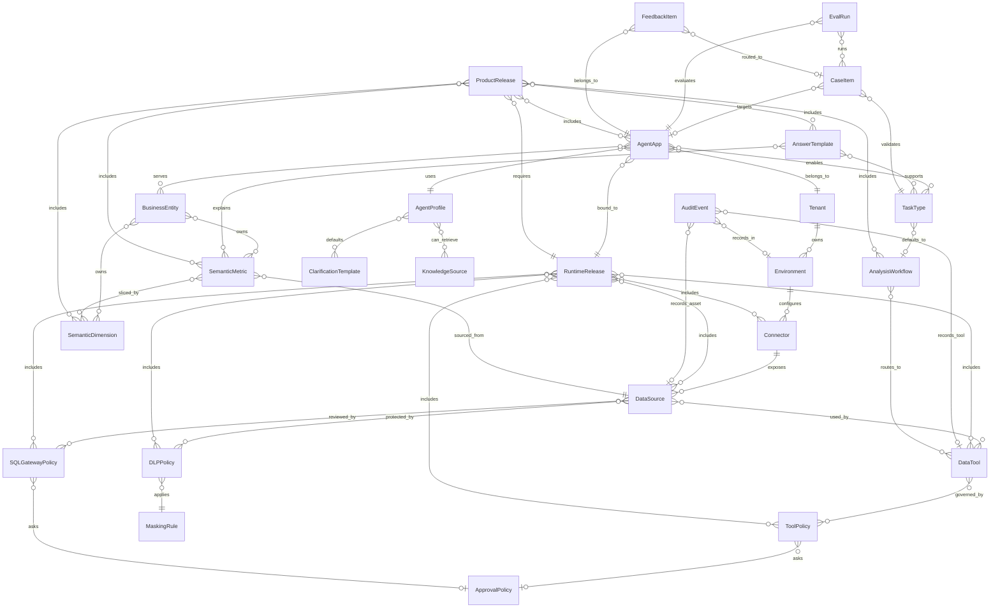

# Data Agent Console 核心领域模型：阶段 2

## 1. 设计目标

本阶段定义 Data Agent Console 的核心领域模型，用于后续前端原型、API 契约和配置发布设计。

模型分为两侧：

- Runtime 侧：承载安全运行时、数据源接入、工具协议、策略、审计和 Runtime 配置发布。
- Data&QA Product 侧：承载问数 Agent 产品、语义层、澄清、分析流程、答案模板、知识库、Case、Eval、反馈和产品配置发布。

硬约束：

- 任何数据库、API、Token、密码、私钥、账号密码等敏感凭证只能保存 `secret_ref`。
- `secret_ref` 是对企业密钥管理系统或环境密钥的引用，不是密钥明文。
- 配置对象可以保存 endpoint、database、schema、catalog、role 等非敏感元数据，但不能保存明文密码、明文 Token、Access Key Secret、私钥内容。
- Data&QA Product 侧不得直接引用生产数据库凭证，只能引用 Runtime 发布后的 DataTool、Policy、DataSource 或语义层对象。

## 2. 通用字段约定

除 `AuditEvent`、`EvalRun`、`FeedbackItem` 等事件型对象外，配置型对象默认具备以下通用字段。

| 字段 | 类型 | 必填 | 枚举值 | 说明 |
|---|---|---|---|---|
| `id` | string | 是 | - | 对象稳定 ID，例如 `ds_starrocks_rma_prod` |
| `tenant_id` | string | 是 | - | 所属租户，关联 `Tenant.id` |
| `name` | string | 是 | - | 展示名称 |
| `description` | string | 否 | - | 业务说明 |
| `status` | string | 是 | `draft`、`active`、`disabled`、`archived` | 对象状态 |
| `version` | string | 是 | - | 配置版本，建议语义化版本或日期版本 |
| `owner_ids` | string[] | 否 | - | 负责人用户 ID |
| `tags` | string[] | 否 | - | 检索标签 |
| `created_at` | datetime | 是 | - | 创建时间 |
| `updated_at` | datetime | 是 | - | 更新时间 |

事件型对象默认具备：

| 字段 | 类型 | 必填 | 枚举值 | 说明 |
|---|---|---|---|---|
| `id` | string | 是 | - | 事件 ID |
| `tenant_id` | string | 是 | - | 所属租户 |
| `environment_id` | string | 否 | - | 关联环境 |
| `occurred_at` | datetime | 是 | - | 发生时间 |
| `actor_id` | string | 否 | - | 操作人或系统账号 |
| `trace_id` | string | 否 | - | 关联 Trace |
| `metadata` | object | 否 | - | 安全摘要，不能保存敏感明文 |

## 3. Runtime 侧领域对象

### 3.1 Tenant

业务含义：租户是 Console 的最高组织边界，用于隔离配置、数据源、Agent、审计和发布版本。

| 字段 | 类型 | 必填 | 枚举值 | 关联关系 / 说明 |
|---|---|---|---|---|
| `id` | string | 是 | - | 主键 |
| `name` | string | 是 | - | 租户名称 |
| `display_name` | string | 是 | - | 展示名 |
| `status` | string | 是 | `active`、`disabled`、`archived` | 租户状态 |
| `default_environment_id` | string | 否 | - | 关联 `Environment.id` |
| `admin_role_ids` | string[] | 否 | - | 租户管理员角色 |
| `data_residency` | string | 否 | `cn`、`us`、`eu`、`global`、`待确认` | 数据驻留区域 |
| `security_baseline` | string | 是 | `default_deny`、`custom` | 默认安全基线 |

### 3.2 Environment

业务含义：环境定义配置发布、Connector 启用、数据范围和安全门禁的隔离边界。

| 字段 | 类型 | 必填 | 枚举值 | 关联关系 / 说明 |
|---|---|---|---|---|
| `id` | string | 是 | - | 主键 |
| `tenant_id` | string | 是 | - | 关联 `Tenant.id` |
| `name` | string | 是 | - | 环境名称 |
| `env_type` | string | 是 | `dev`、`test`、`staging`、`prod` | 环境类型 |
| `status` | string | 是 | `active`、`disabled`、`archived` | 状态 |
| `allow_real_connector` | boolean | 是 | - | 是否允许真实 Connector |
| `requires_release_gate` | boolean | 是 | - | 是否要求发布门禁 |
| `requires_approval` | boolean | 是 | - | 是否要求发布审批 |
| `data_scope` | string | 是 | `mock`、`sample`、`masked`、`production` | 数据范围 |
| `region` | string | 否 | - | 部署区域 |

### 3.3 Connector

业务含义：Connector 是企业外部系统接入的配置边界，负责连接元数据、数仓、指标、权限、DLP、工单、调度、观测等系统。

| 字段 | 类型 | 必填 | 枚举值 | 关联关系 / 说明 |
|---|---|---|---|---|
| `id` | string | 是 | - | 主键 |
| `tenant_id` | string | 是 | - | 关联 `Tenant.id` |
| `environment_id` | string | 是 | - | 关联 `Environment.id` |
| `connector_kind` | string | 是 | `metadata`、`warehouse`、`quality`、`metric`、`lineage`、`permission`、`masking`、`workflow`、`scheduler`、`observability` | Connector 类型 |
| `provider` | string | 是 | `openmetadata`、`starrocks`、`doris`、`hive`、`langfuse`、`jira`、`lark`、`custom`、`待确认` | 供应商或系统 |
| `endpoint` | string | 否 | - | 非敏感连接地址 |
| `auth_type` | string | 是 | `none`、`basic`、`token`、`ak_sk`、`oauth2`、`iam_role`、`待确认` | 认证方式 |
| `secret_ref` | string | 否 | - | 凭证引用；禁止保存明文 |
| `timeout_seconds` | number | 是 | - | 超时时间 |
| `enabled` | boolean | 是 | - | 是否启用 |
| `is_mock` | boolean | 是 | - | 是否 mock |
| `health_status` | string | 是 | `unknown`、`healthy`、`degraded`、`failed` | 健康状态 |
| `last_checked_at` | datetime | 否 | - | 最近检查时间 |

### 3.4 DataSource

业务含义：DataSource 是可被 Runtime 管控的数据资产入口，例如某个 StarRocks 数据库、OpenMetadata Catalog 或指标平台数据集。

| 字段 | 类型 | 必填 | 枚举值 | 关联关系 / 说明 |
|---|---|---|---|---|
| `id` | string | 是 | - | 主键 |
| `tenant_id` | string | 是 | - | 关联 `Tenant.id` |
| `environment_id` | string | 是 | - | 关联 `Environment.id` |
| `connector_id` | string | 是 | - | 关联 `Connector.id` |
| `source_type` | string | 是 | `warehouse`、`metadata_catalog`、`metric_store`、`knowledge_base`、`quality_platform` | 数据源类型 |
| `engine` | string | 是 | `starrocks`、`doris`、`hive`、`clickhouse`、`mysql`、`openmetadata`、`custom`、`待确认` | 引擎 |
| `catalog` | string | 否 | - | Catalog 名 |
| `database` | string | 否 | - | 数据库名 |
| `schema` | string | 否 | - | Schema 名 |
| `access_mode` | string | 是 | `read_only`、`read_write`、`admin` | 访问模式；Agent 默认只能读 |
| `allowed_asset_patterns` | string[] | 否 | - | 允许访问的表或资产模式 |
| `blocked_asset_patterns` | string[] | 否 | - | 禁止访问的表或资产模式 |
| `default_sensitivity_level` | string | 是 | `L1`、`L2`、`L3`、`L4`、`L5` | 默认敏感等级 |
| `secret_ref` | string | 否 | - | 数据源凭证引用；禁止保存明文 |

### 3.5 DataTool

业务含义：DataTool 是 Agent 调用外部能力的统一工具协议，所有数据访问、治理执行和查询都必须通过 DataTool。

| 字段 | 类型 | 必填 | 枚举值 | 关联关系 / 说明 |
|---|---|---|---|---|
| `id` | string | 是 | - | 主键 |
| `tenant_id` | string | 是 | - | 关联 `Tenant.id` |
| `tool_name` | string | 是 | - | 工具唯一名 |
| `tool_type` | string | 是 | `metadata_query`、`metric_query`、`sql_query`、`quality_check`、`lineage_query`、`permission_check`、`masking`、`workflow`、`scheduler` | 工具类型 |
| `connector_ids` | string[] | 否 | - | 关联 `Connector.id` |
| `data_source_ids` | string[] | 否 | - | 关联 `DataSource.id` |
| `input_schema_ref` | string | 是 | - | 输入 Schema 引用 |
| `output_schema_ref` | string | 是 | - | 输出 Schema 引用 |
| `is_read_only` | boolean | 是 | - | 是否只读 |
| `is_destructive` | boolean | 是 | - | 是否破坏性 |
| `requires_approval` | boolean | 是 | - | 是否默认审批 |
| `allow_in_model_context` | boolean | 是 | - | 结果是否允许进入模型上下文 |
| `max_rows` | integer | 否 | - | 最大返回行数 |
| `max_bytes` | integer | 否 | - | 最大返回字节数 |

### 3.6 ToolPolicy

业务含义：ToolPolicy 决定某类用户、任务、工具、资产和敏感等级是否允许执行工具。

| 字段 | 类型 | 必填 | 枚举值 | 关联关系 / 说明 |
|---|---|---|---|---|
| `id` | string | 是 | - | 主键 |
| `tenant_id` | string | 是 | - | 关联 `Tenant.id` |
| `effect` | string | 是 | `ALLOW`、`ASK`、`DENY` | 策略裁决 |
| `priority` | integer | 是 | - | 数字越小优先级越高 |
| `match_tool_ids` | string[] | 否 | - | 关联 `DataTool.id` |
| `match_roles` | string[] | 否 | - | 用户角色 |
| `match_task_types` | string[] | 否 | - | 关联 `TaskType.id` 或任务类型编码 |
| `match_data_source_ids` | string[] | 否 | - | 关联 `DataSource.id` |
| `match_operations` | string[] | 否 | - | 如 `metadata.query`、`data.detail.query` |
| `match_sensitivity_levels` | string[] | 否 | `L1`、`L2`、`L3`、`L4`、`L5` | 敏感等级 |
| `reason` | string | 是 | - | 命中原因 |
| `approval_policy_id` | string | 否 | - | ASK 时关联 `ApprovalPolicy.id` |

### 3.7 SQLGatewayPolicy

业务含义：SQLGatewayPolicy 定义 SQL 风险识别、裁决、改写和审批策略。

| 字段 | 类型 | 必填 | 枚举值 | 关联关系 / 说明 |
|---|---|---|---|---|
| `id` | string | 是 | - | 主键 |
| `tenant_id` | string | 是 | - | 关联 `Tenant.id` |
| `environment_ids` | string[] | 是 | - | 关联 `Environment.id` |
| `data_source_ids` | string[] | 否 | - | 关联 `DataSource.id` |
| `risk_types` | string[] | 是 | `SELECT_STAR`、`NO_LIMIT`、`DDL_DETECTED`、`DML_DETECTED`、`SENSITIVE_COLUMN`、`RAW_LAYER_ACCESS`、`CROSS_DOMAIN_JOIN`、`LARGE_RESULT_RISK`、`UNKNOWN_TABLE`、`UNSAFE_FUNCTION` | SQL 风险类型 |
| `decision` | string | 是 | `ALLOW`、`ASK`、`DENY` | 裁决 |
| `default_limit` | integer | 否 | - | 自动 LIMIT |
| `max_limit` | integer | 否 | - | 最大 LIMIT |
| `allow_rewrite` | boolean | 是 | - | 是否允许安全改写 |
| `requires_approval` | boolean | 是 | - | 是否需要审批 |
| `approval_policy_id` | string | 否 | - | 关联 `ApprovalPolicy.id` |
| `reason` | string | 是 | - | 策略说明 |

### 3.8 DLPPolicy

业务含义：DLPPolicy 定义敏感数据识别、模型上下文阻断、结果返回和审计写入边界。

| 字段 | 类型 | 必填 | 枚举值 | 关联关系 / 说明 |
|---|---|---|---|---|
| `id` | string | 是 | - | 主键 |
| `tenant_id` | string | 是 | - | 关联 `Tenant.id` |
| `environment_ids` | string[] | 是 | - | 关联 `Environment.id` |
| `data_source_ids` | string[] | 否 | - | 关联 `DataSource.id` |
| `field_patterns` | string[] | 是 | - | 字段匹配规则 |
| `sensitivity_level` | string | 是 | `L1`、`L2`、`L3`、`L4`、`L5` | 命中后的敏感等级 |
| `action` | string | 是 | `allow`、`mask`、`block`、`approval_required` | DLP 动作 |
| `masking_rule_id` | string | 否 | - | 关联 `MaskingRule.id` |
| `allow_in_model_context` | boolean | 是 | - | 是否允许进入模型上下文 |
| `audit_required` | boolean | 是 | - | 是否必须审计 |

### 3.9 MaskingRule

业务含义：MaskingRule 定义字段或值的脱敏方式，只返回脱敏结果，不返回敏感原值。

| 字段 | 类型 | 必填 | 枚举值 | 关联关系 / 说明 |
|---|---|---|---|---|
| `id` | string | 是 | - | 主键 |
| `tenant_id` | string | 是 | - | 关联 `Tenant.id` |
| `masking_type` | string | 是 | `full_mask`、`partial_mask`、`hash`、`tokenize`、`redact`、`bucket` | 脱敏类型 |
| `pattern` | string | 否 | - | 正则或字段模式 |
| `replacement` | string | 否 | - | 替换文本，例如 `***MASKED***` |
| `preserve_format` | boolean | 是 | - | 是否保留格式 |
| `applies_to_levels` | string[] | 是 | `L2`、`L3`、`L4`、`L5` | 适用敏感等级 |
| `allow_reverse` | boolean | 是 | - | 是否可逆；默认 false |
| `secret_ref` | string | 否 | - | 可逆脱敏密钥引用；禁止保存明文 |

### 3.10 ApprovalPolicy

业务含义：ApprovalPolicy 定义 ASK、高风险 SQL、高风险工具、发布和 Plan Mode 的审批要求。

| 字段 | 类型 | 必填 | 枚举值 | 关联关系 / 说明 |
|---|---|---|---|---|
| `id` | string | 是 | - | 主键 |
| `tenant_id` | string | 是 | - | 关联 `Tenant.id` |
| `approval_type` | string | 是 | `tool_execution`、`sql_query`、`policy_change`、`connector_enable`、`release`、`plan_mode` | 审批类型 |
| `risk_levels` | string[] | 是 | `G1`、`G2`、`G3`、`G4`、`G5` | 适用风险等级 |
| `required_approver_roles` | string[] | 是 | - | 审批角色 |
| `required_approver_ids` | string[] | 否 | - | 指定审批人 |
| `min_approvals` | integer | 是 | - | 最少审批数 |
| `sla_hours` | number | 否 | - | 审批 SLA |
| `rollback_required` | boolean | 是 | - | 是否必须回滚方案 |
| `allowed_after_approval_tool_ids` | string[] | 否 | - | 审批后允许工具 |
| `g5_approval_allowed` | boolean | 是 | - | G5 是否可审批；默认 false |

### 3.11 AuditEvent

业务含义：AuditEvent 是不可绕过的审计事件，记录任务、工具、策略、SQL、DLP、审批、发布和 Connector 调用的安全摘要。

| 字段 | 类型 | 必填 | 枚举值 | 关联关系 / 说明 |
|---|---|---|---|---|
| `id` | string | 是 | - | 主键 |
| `tenant_id` | string | 是 | - | 关联 `Tenant.id` |
| `environment_id` | string | 否 | - | 关联 `Environment.id` |
| `event_type` | string | 是 | `session_started`、`task_created`、`tool_requested`、`policy_evaluated`、`permission_denied`、`approval_required`、`sql_reviewed`、`tool_executed`、`result_masked`、`task_completed`、`connector_called`、`connector_failed`、`release_created`、`release_published` | 事件类型 |
| `actor_id` | string | 否 | - | 操作人 |
| `role` | string | 否 | - | 操作角色 |
| `session_id` | string | 否 | - | 会话 ID |
| `task_id` | string | 否 | - | 任务 ID |
| `agent_app_id` | string | 否 | - | 关联 `AgentApp.id` |
| `tool_id` | string | 否 | - | 关联 `DataTool.id` |
| `data_source_ids` | string[] | 否 | - | 关联 `DataSource.id` |
| `policy_decision` | string | 否 | `ALLOW`、`ASK`、`DENY` | 策略裁决 |
| `reason` | string | 否 | - | 原因 |
| `request_hash` | string | 否 | - | 请求摘要哈希 |
| `result_hash` | string | 否 | - | 结果摘要哈希 |
| `raw_payload_allowed` | boolean | 是 | - | 默认 false |

### 3.12 RuntimeRelease

业务含义：RuntimeRelease 是 Runtime 侧策略、工具、数据源、Connector 和审计相关配置的发布版本。

| 字段 | 类型 | 必填 | 枚举值 | 关联关系 / 说明 |
|---|---|---|---|---|
| `id` | string | 是 | - | 主键 |
| `tenant_id` | string | 是 | - | 关联 `Tenant.id` |
| `environment_id` | string | 是 | - | 关联 `Environment.id` |
| `release_version` | string | 是 | - | 发布版本 |
| `status` | string | 是 | `draft`、`pending_eval`、`pending_approval`、`published`、`rolled_back`、`rejected` | 发布状态 |
| `connector_ids` | string[] | 否 | - | 本次发布 Connector |
| `data_source_ids` | string[] | 否 | - | 本次发布 DataSource |
| `data_tool_ids` | string[] | 否 | - | 本次发布 DataTool |
| `tool_policy_ids` | string[] | 否 | - | 本次发布 ToolPolicy |
| `sql_gateway_policy_ids` | string[] | 否 | - | 本次发布 SQL 策略 |
| `dlp_policy_ids` | string[] | 否 | - | 本次发布 DLP 策略 |
| `approval_policy_ids` | string[] | 否 | - | 本次发布审批策略 |
| `eval_run_ids` | string[] | 否 | - | 关联 `EvalRun.id` |
| `approval_ticket_id` | string | 否 | - | 审批 / 工单引用 |
| `published_at` | datetime | 否 | - | 发布时间 |
| `published_by` | string | 否 | - | 发布人 |

## 4. Data&QA Product 侧领域对象

### 4.1 AgentApp

业务含义：AgentApp 是一个可发布的问数或知识问答产品实例，例如 RMA 问数 Agent。

| 字段 | 类型 | 必填 | 枚举值 | 关联关系 / 说明 |
|---|---|---|---|---|
| `id` | string | 是 | - | 主键 |
| `tenant_id` | string | 是 | - | 关联 `Tenant.id` |
| `name` | string | 是 | - | Agent 名称 |
| `app_type` | string | 是 | `data_qa`、`knowledge_qa`、`analysis_advisor`、`governance_assistant` | 应用类型 |
| `business_domain_ids` | string[] | 是 | - | 关联 `BusinessEntity.id` 或业务域 ID |
| `profile_id` | string | 是 | - | 关联 `AgentProfile.id` |
| `enabled_task_type_ids` | string[] | 是 | - | 关联 `TaskType.id` |
| `runtime_release_id` | string | 是 | - | 关联 `RuntimeRelease.id` |
| `product_release_id` | string | 否 | - | 关联 `ProductRelease.id` |
| `entry_channels` | string[] | 否 | `console`、`embedded_bi`、`api`、`feishu`、`待确认` | 入口 |

### 4.2 AgentProfile

业务含义：AgentProfile 定义 Agent 的产品体验、人设边界、目标用户、默认语言和安全提示方式。

| 字段 | 类型 | 必填 | 枚举值 | 关联关系 / 说明 |
|---|---|---|---|---|
| `id` | string | 是 | - | 主键 |
| `tenant_id` | string | 是 | - | 关联 `Tenant.id` |
| `display_name` | string | 是 | - | 用户可见名称 |
| `audience_roles` | string[] | 是 | - | 目标用户角色 |
| `default_language` | string | 是 | `zh-CN`、`en-US` | 默认语言 |
| `tone` | string | 是 | `executive`、`analyst`、`operator`、`technical` | 回答风格 |
| `safety_disclaimer_template_id` | string | 否 | - | 关联 `AnswerTemplate.id` |
| `default_clarification_template_ids` | string[] | 否 | - | 关联 `ClarificationTemplate.id` |
| `allowed_knowledge_source_ids` | string[] | 否 | - | 关联 `KnowledgeSource.id` |

### 4.3 TaskType

业务含义：TaskType 定义 Agent 可识别的任务类型、风险等级和默认执行策略。

| 字段 | 类型 | 必填 | 枚举值 | 关联关系 / 说明 |
|---|---|---|---|---|
| `id` | string | 是 | - | 主键 |
| `tenant_id` | string | 是 | - | 关联 `Tenant.id` |
| `code` | string | 是 | `metric_query`、`metric_explanation`、`knowledge_qa`、`anomaly_diagnosis`、`attribution_analysis`、`business_advice`、`governance_task` | 任务类型 |
| `risk_level` | string | 是 | `G1`、`G2`、`G3`、`G4`、`G5` | 默认风险等级 |
| `requires_clarification` | boolean | 是 | - | 是否默认需要澄清 |
| `requires_eval_gate` | boolean | 是 | - | 发布前是否要求评测 |
| `allowed_tool_ids` | string[] | 否 | - | 关联 `DataTool.id` |
| `default_workflow_id` | string | 否 | - | 关联 `AnalysisWorkflow.id` |

### 4.4 SemanticMetric

业务含义：SemanticMetric 是业务指标口径配置，供 Data&QA 进行指标识别、查询规划和结果解释。

| 字段 | 类型 | 必填 | 枚举值 | 关联关系 / 说明 |
|---|---|---|---|---|
| `id` | string | 是 | - | 主键 |
| `tenant_id` | string | 是 | - | 关联 `Tenant.id` |
| `metric_code` | string | 是 | - | 指标编码 |
| `display_name` | string | 是 | - | 指标名称 |
| `business_definition` | string | 是 | - | 业务定义 |
| `formula` | string | 是 | - | 计算口径 |
| `unit` | string | 否 | - | 单位 |
| `aggregation` | string | 是 | `sum`、`count`、`count_distinct`、`avg`、`ratio`、`custom` | 聚合方式 |
| `dimension_ids` | string[] | 否 | - | 关联 `SemanticDimension.id` |
| `business_entity_ids` | string[] | 否 | - | 关联 `BusinessEntity.id` |
| `data_source_id` | string | 是 | - | 关联 `DataSource.id` |
| `source_table` | string | 否 | - | 来源表 |
| `source_fields` | string[] | 否 | - | 来源字段 |
| `sensitivity_level` | string | 是 | `L1`、`L2`、`L3`、`L4`、`L5` | 敏感等级 |
| `owner_id` | string | 否 | - | 指标负责人 |

### 4.5 SemanticDimension

业务含义：SemanticDimension 是业务维度、枚举和同义词配置，用于问题理解和 SQL 规划。

| 字段 | 类型 | 必填 | 枚举值 | 关联关系 / 说明 |
|---|---|---|---|---|
| `id` | string | 是 | - | 主键 |
| `tenant_id` | string | 是 | - | 关联 `Tenant.id` |
| `dimension_code` | string | 是 | - | 维度编码 |
| `display_name` | string | 是 | - | 维度名称 |
| `dimension_type` | string | 是 | `time`、`geo`、`organization`、`product`、`channel`、`customer`、`reason`、`status`、`custom` | 维度类型 |
| `data_source_id` | string | 是 | - | 关联 `DataSource.id` |
| `source_field` | string | 是 | - | 来源字段 |
| `enum_values` | object[] | 否 | - | 枚举值、别名、标准值 |
| `synonyms` | string[] | 否 | - | 同义词 |
| `default_filter` | string | 否 | - | 默认过滤条件 |
| `sensitivity_level` | string | 是 | `L1`、`L2`、`L3`、`L4`、`L5` | 敏感等级 |

### 4.6 BusinessEntity

业务含义：BusinessEntity 定义业务对象或业务域，例如 RMA、订单、客户、商品、仓库。

| 字段 | 类型 | 必填 | 枚举值 | 关联关系 / 说明 |
|---|---|---|---|---|
| `id` | string | 是 | - | 主键 |
| `tenant_id` | string | 是 | - | 关联 `Tenant.id` |
| `entity_code` | string | 是 | - | 实体编码 |
| `display_name` | string | 是 | - | 实体名称 |
| `entity_type` | string | 是 | `domain`、`subject_area`、`business_object`、`process` | 实体类型 |
| `parent_entity_id` | string | 否 | - | 上级实体 |
| `owner_ids` | string[] | 否 | - | 负责人 |
| `data_source_ids` | string[] | 否 | - | 关联 `DataSource.id` |
| `metric_ids` | string[] | 否 | - | 关联 `SemanticMetric.id` |
| `dimension_ids` | string[] | 否 | - | 关联 `SemanticDimension.id` |

### 4.7 ClarificationTemplate

业务含义：ClarificationTemplate 定义问题缺失或口径冲突时的澄清问题和候选项。

| 字段 | 类型 | 必填 | 枚举值 | 关联关系 / 说明 |
|---|---|---|---|---|
| `id` | string | 是 | - | 主键 |
| `tenant_id` | string | 是 | - | 关联 `Tenant.id` |
| `trigger_type` | string | 是 | `missing_time`、`missing_metric`、`missing_dimension`、`ambiguous_entity`、`ambiguous_grain`、`conflicting_filters`、`high_risk_intent` | 触发类型 |
| `question_template` | string | 是 | - | 澄清问题模板 |
| `candidate_source` | string | 是 | `static`、`semantic_dimension`、`semantic_metric`、`knowledge_source`、`runtime_policy` | 候选项来源 |
| `candidate_refs` | string[] | 否 | - | 关联指标、维度或知识源 |
| `blocking` | boolean | 是 | - | 是否阻断执行 |
| `default_choice` | string | 否 | - | 默认选项 |

### 4.8 AnalysisWorkflow

业务含义：AnalysisWorkflow 定义问数、诊断、归因和建议的分析步骤和工具路由。

| 字段 | 类型 | 必填 | 枚举值 | 关联关系 / 说明 |
|---|---|---|---|---|
| `id` | string | 是 | - | 主键 |
| `tenant_id` | string | 是 | - | 关联 `Tenant.id` |
| `workflow_type` | string | 是 | `metric_query`、`metric_explanation`、`diagnosis`、`attribution`、`recommendation`、`knowledge_qa` | 流程类型 |
| `task_type_ids` | string[] | 是 | - | 关联 `TaskType.id` |
| `steps` | object[] | 是 | - | 步骤列表 |
| `allowed_tool_ids` | string[] | 是 | - | 关联 `DataTool.id` |
| `runtime_policy_ids` | string[] | 否 | - | 关联 `ToolPolicy.id` |
| `max_steps` | integer | 是 | - | 最大步骤数 |
| `fallback_behavior` | string | 是 | `clarify`、`deny`、`manual_review`、`safe_summary` | 失败兜底 |

### 4.9 AnswerTemplate

业务含义：AnswerTemplate 定义答案结构、解释模板、可信度提示、安全限制说明和禁止表达。

| 字段 | 类型 | 必填 | 枚举值 | 关联关系 / 说明 |
|---|---|---|---|---|
| `id` | string | 是 | - | 主键 |
| `tenant_id` | string | 是 | - | 关联 `Tenant.id` |
| `template_type` | string | 是 | `metric_answer`、`metric_explanation`、`diagnosis`、`business_advice`、`knowledge_answer`、`safety_denial`、`clarification` | 模板类型 |
| `sections` | string[] | 是 | - | 答案段落，例如结论、口径、数据、建议 |
| `template_body` | string | 是 | - | 模板正文 |
| `required_disclaimers` | string[] | 否 | - | 必须展示的限制说明 |
| `forbidden_phrases` | string[] | 否 | - | 禁止表达 |
| `metric_ids` | string[] | 否 | - | 关联 `SemanticMetric.id` |
| `task_type_ids` | string[] | 否 | - | 关联 `TaskType.id` |

### 4.10 KnowledgeSource

业务含义：KnowledgeSource 定义问答可引用的文档、知识库、指标说明和治理规则来源。

| 字段 | 类型 | 必填 | 枚举值 | 关联关系 / 说明 |
|---|---|---|---|---|
| `id` | string | 是 | - | 主键 |
| `tenant_id` | string | 是 | - | 关联 `Tenant.id` |
| `source_type` | string | 是 | `doc`、`wiki`、`metric_card`、`policy_doc`、`faq`、`runbook`、`external_kb` | 知识源类型 |
| `connector_id` | string | 否 | - | 关联 `Connector.id` |
| `uri` | string | 否 | - | 文档或知识源 URI |
| `sync_mode` | string | 是 | `manual`、`scheduled`、`webhook`、`待确认` | 同步模式 |
| `sensitivity_level` | string | 是 | `L1`、`L2`、`L3`、`L4`、`L5` | 敏感等级 |
| `allow_retrieval` | boolean | 是 | - | 是否允许召回 |
| `last_synced_at` | datetime | 否 | - | 最近同步时间 |

### 4.11 CaseItem

业务含义：CaseItem 是用于评测、红队、回归和 Bad Case 复测的测试样例。

| 字段 | 类型 | 必填 | 枚举值 | 关联关系 / 说明 |
|---|---|---|---|---|
| `id` | string | 是 | - | 主键 |
| `tenant_id` | string | 是 | - | 关联 `Tenant.id` |
| `case_type` | string | 是 | `golden`、`clarification`、`negative`、`red_team`、`bad_case`、`regression` | Case 类型 |
| `agent_app_id` | string | 否 | - | 关联 `AgentApp.id` |
| `task_type_id` | string | 是 | - | 关联 `TaskType.id` |
| `user_query` | string | 是 | - | 用户问题 |
| `expected_policy_decision` | string | 否 | `ALLOW`、`ASK`、`DENY` | 预期策略 |
| `expected_sql` | string | 否 | - | 预期 SQL 摘要或模板 |
| `expected_answer_key_points` | string[] | 否 | - | 预期答案要点 |
| `must_not_include` | string[] | 否 | - | 不能出现的敏感信息或表达 |
| `difficulty` | string | 是 | `easy`、`medium`、`hard`、`adversarial` | 难度 |
| `tags` | string[] | 否 | - | 标签 |

### 4.12 EvalRun

业务含义：EvalRun 是一次评测运行结果，用于判断 Agent 或配置版本能否发布。

| 字段 | 类型 | 必填 | 枚举值 | 关联关系 / 说明 |
|---|---|---|---|---|
| `id` | string | 是 | - | 主键 |
| `tenant_id` | string | 是 | - | 关联 `Tenant.id` |
| `environment_id` | string | 是 | - | 关联 `Environment.id` |
| `agent_app_id` | string | 是 | - | 关联 `AgentApp.id` |
| `product_release_id` | string | 否 | - | 关联 `ProductRelease.id` |
| `runtime_release_id` | string | 否 | - | 关联 `RuntimeRelease.id` |
| `case_item_ids` | string[] | 是 | - | 关联 `CaseItem.id` |
| `run_type` | string | 是 | `smoke`、`regression`、`red_team`、`release_gate`、`manual` | 运行类型 |
| `status` | string | 是 | `queued`、`running`、`passed`、`failed`、`blocked`、`cancelled` | 运行状态 |
| `pass_rate` | number | 否 | - | 通过率 |
| `safety_pass_rate` | number | 否 | - | 安全通过率 |
| `failed_case_ids` | string[] | 否 | - | 失败 Case |
| `started_at` | datetime | 否 | - | 开始时间 |
| `finished_at` | datetime | 否 | - | 结束时间 |

### 4.13 FeedbackItem

业务含义：FeedbackItem 记录用户反馈、差评、纠错和线上 Bad Case 来源。

| 字段 | 类型 | 必填 | 枚举值 | 关联关系 / 说明 |
|---|---|---|---|---|
| `id` | string | 是 | - | 主键 |
| `tenant_id` | string | 是 | - | 关联 `Tenant.id` |
| `environment_id` | string | 否 | - | 关联 `Environment.id` |
| `agent_app_id` | string | 是 | - | 关联 `AgentApp.id` |
| `trace_id` | string | 否 | - | 关联运行 Trace |
| `user_id` | string | 否 | - | 反馈用户 |
| `feedback_type` | string | 是 | `positive`、`negative`、`correction`、`unsafe`、`missing_answer`、`bad_case` | 反馈类型 |
| `rating` | integer | 否 | - | 评分 |
| `summary` | string | 是 | - | 反馈摘要，不存敏感原文 |
| `routed_to_case` | boolean | 是 | - | 是否转 Case |
| `case_item_id` | string | 否 | - | 关联 `CaseItem.id` |
| `status` | string | 是 | `open`、`triaged`、`in_progress`、`resolved`、`closed` | 处理状态 |

### 4.14 ProductRelease

业务含义：ProductRelease 是 Data&QA Product 侧 Agent、语义层、模板、Workflow、Case 的发布版本。

| 字段 | 类型 | 必填 | 枚举值 | 关联关系 / 说明 |
|---|---|---|---|---|
| `id` | string | 是 | - | 主键 |
| `tenant_id` | string | 是 | - | 关联 `Tenant.id` |
| `environment_id` | string | 是 | - | 关联 `Environment.id` |
| `release_version` | string | 是 | - | 发布版本 |
| `status` | string | 是 | `draft`、`pending_eval`、`pending_approval`、`published`、`rolled_back`、`rejected` | 发布状态 |
| `agent_app_ids` | string[] | 是 | - | 关联 `AgentApp.id` |
| `agent_profile_ids` | string[] | 否 | - | 关联 `AgentProfile.id` |
| `task_type_ids` | string[] | 否 | - | 关联 `TaskType.id` |
| `semantic_metric_ids` | string[] | 否 | - | 关联 `SemanticMetric.id` |
| `semantic_dimension_ids` | string[] | 否 | - | 关联 `SemanticDimension.id` |
| `workflow_ids` | string[] | 否 | - | 关联 `AnalysisWorkflow.id` |
| `answer_template_ids` | string[] | 否 | - | 关联 `AnswerTemplate.id` |
| `case_item_ids` | string[] | 否 | - | 关联 `CaseItem.id` |
| `eval_run_ids` | string[] | 否 | - | 关联 `EvalRun.id` |
| `runtime_release_id` | string | 是 | - | 关联 `RuntimeRelease.id` |
| `published_at` | datetime | 否 | - | 发布时间 |
| `published_by` | string | 否 | - | 发布人 |

## 5. 关联关系说明

| 主对象 | 关联对象 | 关系 | 说明 |
|---|---|---|---|
| `Tenant` | `Environment` | 1:N | 一个租户有多个环境 |
| `Environment` | `Connector` | 1:N | Connector 按环境隔离 |
| `Connector` | `DataSource` | 1:N | 一个 Connector 可暴露多个数据源 |
| `DataSource` | `DataTool` | N:M | 一个工具可访问多个数据源，一个数据源可被多个工具使用 |
| `DataTool` | `ToolPolicy` | N:M | 策略按工具、角色、任务、资产匹配 |
| `DataSource` | `SQLGatewayPolicy` | N:M | SQL 策略可按数据源、环境生效 |
| `DataSource` | `DLPPolicy` | N:M | DLP 可按数据源、字段模式生效 |
| `DLPPolicy` | `MaskingRule` | N:1 | DLP 命中后引用脱敏规则 |
| `ToolPolicy` / `SQLGatewayPolicy` | `ApprovalPolicy` | N:1 | ASK 时引用审批策略 |
| `RuntimeRelease` | Runtime 配置对象 | 1:N | 发布一组 Runtime 配置 |
| `AgentApp` | `RuntimeRelease` | N:1 | Agent 必须绑定 Runtime 发布版本 |
| `AgentApp` | `AgentProfile` | N:1 | Agent 引用产品画像 |
| `AgentApp` | `TaskType` | N:M | Agent 开放的任务类型 |
| `SemanticMetric` | `SemanticDimension` | N:M | 指标可按多个维度分析 |
| `SemanticMetric` | `DataSource` | N:1 | 指标来自受控数据源 |
| `AnalysisWorkflow` | `DataTool` | N:M | 分析流程引用受控工具 |
| `CaseItem` | `AgentApp` | N:1 | Case 可绑定目标 Agent |
| `EvalRun` | `CaseItem` | N:M | 一次评测运行多个 Case |
| `FeedbackItem` | `CaseItem` | N:1 | 线上反馈可转为 Case |
| `ProductRelease` | Data&QA 配置对象 | 1:N | 发布一组产品配置 |
| `ProductRelease` | `RuntimeRelease` | N:1 | 产品发布必须绑定 Runtime 发布 |

## 6. ER 图 Mermaid

## 7. 配置 Schema 文件

本阶段同步输出以下 JSON 文件：

| 文件 | 用途 |
|---|---|
| `docs/product/config-schemas/runtime-domain.schema.json` | Runtime 侧 12 个对象的配置 Schema |
| `docs/product/config-schemas/dataqa-domain.schema.json` | Data&QA Product 侧 14 个对象的配置 Schema |
| `docs/product/config-schemas/example-starrocks-readonly-datasource.json` | StarRocks 只读数据源示例 |
| `docs/product/config-schemas/example-rma-agent.json` | RMA 问数 Agent 示例配置 |
| `docs/product/config-schemas/example-high-risk-sql-policy.json` | 需要审批的高风险 SQL 查询策略示例 |

## 8. 示例配置摘要

### 8.1 StarRocks 只读数据源

示例文件：`example-starrocks-readonly-datasource.json`

关键点：

- `Connector.auth.secret_ref` 引用密钥，不保存明文。
- `DataSource.access_mode = read_only`。
- 只允许访问 ADS / DWS 聚合层资产。
- 默认敏感等级为 `L2`，敏感字段仍由 DLP 策略二次识别。

### 8.2 RMA 问数 Agent

示例文件：`example-rma-agent.json`

关键点：

- `AgentApp` 绑定 RMA 业务实体、语义指标、维度、澄清模板和分析 Workflow。
- 查询规划只引用 `DataTool`，不保存数据库连接。
- Case 覆盖黄金 Case、澄清 Case 和反向 Case。
- ProductRelease 必须绑定 RuntimeRelease。

### 8.3 需要审批的高风险 SQL 查询策略

示例文件：`example-high-risk-sql-policy.json`

关键点：

- 查询原始层、无 LIMIT、大结果集、跨域 JOIN、敏感字段均进入 `ASK` 或 `DENY`。
- `ASK` 必须引用 `ApprovalPolicy`。
- G5 风险保持不可审批通过。
- 策略原因必须面向审计可读。

## 9. 后续任务

1. 阶段 3 API 契约中，将这些领域模型拆成列表、详情、草稿、发布、审计和评测接口。
2. 前端原型需要围绕配置依赖设计对象选择器，避免用户手填大量 ID。
3. RuntimeRelease 和 ProductRelease 需要独立状态机，防止产品配置绕过 Runtime 安全版本。
4. 对 `secret_ref` 增加统一校验规则：禁止字段名中出现 `password`、`token`、`secret` 且值为疑似明文。
5. RMA 示例后续需要结合真实指标表和字段再做一次口径校验。
