# Data Agent Console Runtime 配置页面设计：阶段 3

## 1. 设计目标

本阶段设计 `Data Governance Agent Runtime` 的网页端配置页面，用于把 Runtime 的安全运行边界配置化、可观测化和可发布化。

页面设计遵循前序阶段约束：

- Runtime 负责判断 Agent “能不能安全地做”。
- 所有数据访问必须经过 `DataTool -> Policy Engine -> SQL Gateway -> DLP / Masking -> Audit`。
- Data&QA Product 不能绕过 Runtime 直接访问数据库、Connector 或生产系统。
- 高风险配置必须具备草稿、审批、版本、发布、审计和回滚。
- 敏感凭证只能保存 `secret_ref`，页面不展示、不回显、不导出凭证明文。

本阶段只输出产品页面规格，不写前端代码、不写业务代码、不定义 API 契约。

## 2. 页面设计总览

| 页面 | 页面定位 | 页面模式 | 高风险控制 |
|---|---|---|---|
| Runtime 总览页 | 查看 Runtime 安全链路、运行质量和待处理风险 | 只读观测为主 | 异常跳转到审批、审计或发布单 |
| Connector / DataSource 页面 | 管理外部系统接入和数据源资产边界 | 新增 / 编辑 / 测试 / 发布 | 启用真实连接、生产数据源变更必须审批 |
| DataTool Registry 页面 | 管理 Agent 可调用工具及工具执行边界 | 新增 / 编辑 / 发布 | 高风险工具、非只读工具、允许进模型上下文变更必须审批 |
| Policy Engine 页面 | 管理 RBAC、ABAC、数据域、敏感等级、行列权限与审批策略 | 新增 / 编辑 / 发布 | ALLOW 放宽、DENY 降级、审批策略变更必须审批 |
| SQL Gateway 页面 | 管理 SQL 审查、Dry Run、Explain 和执行限制 | 新增 / 编辑 / 发布 / 只读调试 | 放宽拦截规则、提升扫描量、允许高风险 SQL 必须审批 |
| DLP / Masking 页面 | 管理敏感标签、脱敏规则、动态脱敏和导出限制 | 新增 / 编辑 / 发布 | 降低敏感等级、取消脱敏、允许导出必须审批 |
| Audit 页面 | 查询用户、Agent、工具、SQL、权限、脱敏和审批审计链路 | 只读观测 | 审计策略变更走发布中心，不在审计页直接修改 |

## 3. Runtime 总览页

### 3.1 页面目标

给平台管理员、数据治理负责人、安全合规和发布负责人一个 Runtime 运营驾驶舱，快速判断：

- Runtime 服务是否健康。
- Policy、SQL Gateway、DLP、Audit 是否正常生效。
- 工具调用、SQL 拦截、DLP 命中、审批任务是否异常。
- 最近异常是否需要进入审批、回滚或红队复测。

### 3.2 页面字段

| 字段 | 类型 | 说明 |
|---|---|---|
| `environment_id` | select | 当前环境，支持 dev / test / staging / prod |
| `time_range` | date_range | 统计周期，默认最近 24 小时 |
| `runtime_release_version` | string | 当前 Runtime 发布版本 |
| `product_release_versions` | string[] | 绑定的 Data&QA 产品版本 |
| `health_status` | enum | `healthy`、`degraded`、`failed`、`unknown` |
| `policy_status` | enum | Policy Engine 健康状态 |
| `sql_gateway_status` | enum | SQL Gateway 健康状态 |
| `dlp_status` | enum | DLP / Masking 健康状态 |
| `audit_status` | enum | Audit 写入和链路校验状态 |
| `connector_status` | enum | Connector 总体健康状态 |

### 3.3 指标卡片

| 指标 | 口径 | 点击跳转 |
|---|---|---|
| 服务状态 | Runtime 核心组件健康状态汇总 | 组件健康详情 |
| 工具调用量 | 时间范围内 DataTool 请求数 | 工具调用观测 |
| SQL 拦截次数 | SQL Gateway 返回 `ASK` 或 `DENY` 的次数 | SQL 审查日志 |
| DLP 命中次数 | DLPPolicy 命中并执行 mask / block / approval_required 的次数 | DLP / Masking 日志 |
| 待审批任务 | Plan Mode、SQL、Policy、发布等待审批的任务数 | 审批任务列表 |
| 最近异常 | 最近失败、降级、链路缺失或审计失败事件 | 异常详情 |

### 3.4 按钮

| 按钮 | 行为 | 权限 | 风险控制 |
|---|---|---|---|
| `刷新` | 重新拉取状态和指标 | 可读用户 | 只读 |
| `切换环境` | 切换统计环境 | 可读用户 | 只读 |
| `查看审计` | 跳转到 Audit 页面并带入筛选条件 | 可读用户 | 只读 |
| `查看待审批` | 跳转到审批记录或发布单 | 审批人 / 管理员 | 只读入口 |
| `创建回滚单` | 从异常版本创建回滚发布单 | 发布负责人 | 必须走发布审批 |
| `运行安全红队` | 跳转 Case / Eval 中心创建红队运行 | 安全合规 / 管理员 | 运行结果写审计 |

### 3.5 表格列

#### 最近异常表

| 列 | 说明 |
|---|---|
| `occurred_at` | 发生时间 |
| `severity` | 严重等级：info / warning / critical |
| `component` | 组件：Policy / SQL Gateway / DLP / Audit / Connector / DataTool |
| `environment` | 环境 |
| `summary` | 异常摘要，不展示敏感原文 |
| `related_object` | 关联对象 |
| `policy_decision` | ALLOW / ASK / DENY |
| `audit_event_id` | 审计事件 |
| `owner` | 责任人 |
| `status` | open / investigating / resolved / ignored |

#### 待审批任务表

| 列 | 说明 |
|---|---|
| `approval_id` | 审批 ID |
| `approval_type` | tool_execution / sql_query / policy_change / connector_enable / release / plan_mode |
| `risk_level` | G1 - G5 |
| `object_name` | 关联配置或任务 |
| `requester` | 发起人 |
| `approver_group` | 审批组 |
| `sla_due_at` | SLA 到期时间 |
| `rollback_required` | 是否要求回滚方案 |
| `status` | pending / approved / rejected / expired / canceled |

### 3.6 状态流转

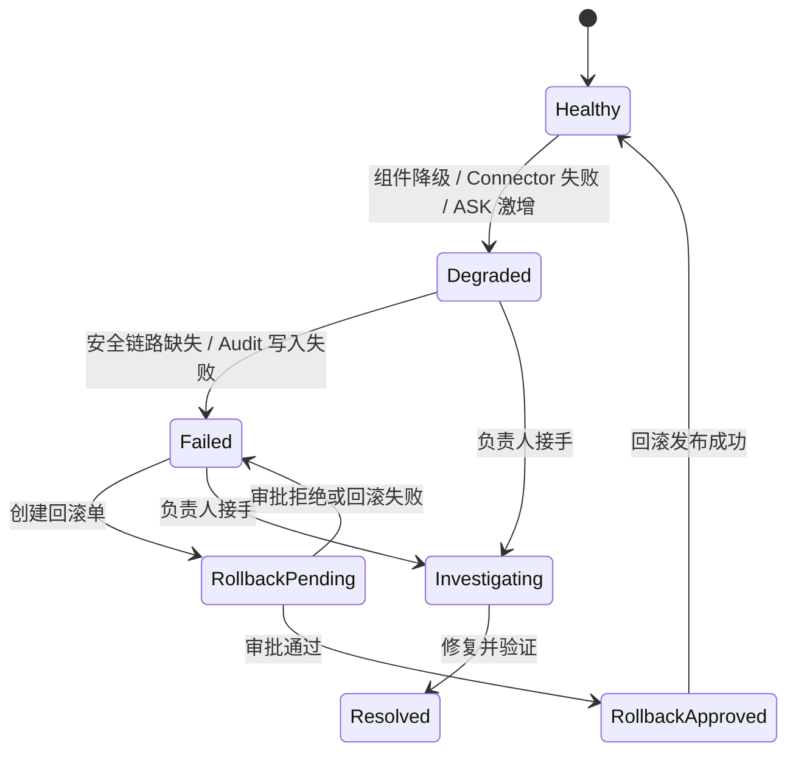

## 4. Connector / DataSource 页面

### 4.1 页面目标

管理外部系统接入和数据源资产边界，包括新增连接器、测试连接、配置只读账号、绑定环境、查看可用 Schema / Table。

核心原则：

- Connector 只保存连接元数据和 `secret_ref`。
- DataSource 只暴露可访问资产范围，不暴露凭证明文。
- 生产环境启用真实 Connector 必须审批并发布。
- Agent 只能通过绑定后的 DataTool 使用 DataSource。

### 4.2 页面布局

左侧为 Connector 列表，右侧为详情抽屉或详情页：

- 基本信息。
- 认证与密钥引用。
- 环境绑定。
- 数据源绑定。
- Schema / Table 浏览。
- 健康检查与调用历史。
- 版本与发布记录。

### 4.3 页面字段

| 字段 | 类型 | 必填 | 说明 |
|---|---|---|---|
| `connector_id` | string | 是 | Connector 稳定 ID |
| `name` | string | 是 | 连接器名称 |
| `connector_kind` | enum | 是 | metadata / warehouse / metric / permission / masking / workflow / scheduler / observability |
| `provider` | enum | 是 | openmetadata / starrocks / doris / hive / langfuse / jira / lark / custom / 待确认 |
| `environment_id` | select | 是 | 绑定环境 |
| `endpoint` | string | 否 | 非敏感服务地址 |
| `auth_type` | enum | 是 | none / basic / token / ak_sk / oauth2 / iam_role / 待确认 |
| `secret_ref` | string | 条件必填 | 凭证引用；页面不展示密钥内容 |
| `timeout_seconds` | number | 是 | 连接超时 |
| `enabled` | boolean | 是 | 是否启用 |
| `is_mock` | boolean | 是 | 是否 mock |
| `health_status` | enum | 是 | unknown / healthy / degraded / failed |
| `owner_ids` | user[] | 否 | 负责人 |
| `version` | string | 是 | 配置版本 |

#### DataSource 字段

| 字段 | 类型 | 必填 | 说明 |
|---|---|---|---|
| `data_source_id` | string | 是 | 数据源 ID |
| `source_type` | enum | 是 | warehouse / metadata_catalog / metric_store / knowledge_base / quality_platform |
| `engine` | enum | 是 | starrocks / doris / hive / clickhouse / mysql / openmetadata / custom / 待确认 |
| `catalog` | string | 否 | Catalog |
| `database` | string | 否 | Database |
| `schema` | string | 否 | Schema |
| `access_mode` | enum | 是 | read_only / read_write / admin；Agent 默认 read_only |
| `readonly_principal` | string | 否 | 只读账号标识或角色名，不保存密码 |
| `secret_ref` | string | 条件必填 | 只读账号凭证引用 |
| `allowed_asset_patterns` | string[] | 否 | 允许访问表 / Schema 模式 |
| `blocked_asset_patterns` | string[] | 否 | 禁止访问表 / Schema 模式 |
| `default_sensitivity_level` | enum | 是 | L1 / L2 / L3 / L4 / L5 |
| `metadata_sync_status` | enum | 是 | not_started / running / succeeded / failed |

### 4.4 按钮

| 按钮 | 行为 | 风险控制 |
|---|---|---|
| `新增连接器` | 创建 Connector 草稿 | 草稿态，不立即启用 |
| `测试连接` | 使用 `secret_ref` 发起健康检查 | 只返回状态、耗时、错误摘要 |
| `保存草稿` | 保存未发布配置 | 写入配置变更记录 |
| `绑定环境` | 选择可用环境 | 生产环境绑定进入审批 |
| `新增数据源` | 在 Connector 下创建 DataSource | 默认 read_only |
| `浏览 Schema / Table` | 拉取可用资产列表 | 只读；受 DataSource 资产范围限制 |
| `同步元数据` | 触发表 / 字段元数据同步 | 写 AuditEvent |
| `提交审批` | 对生产真实 Connector 或高风险数据源提交审批 | 必须填写变更原因和回滚方案 |
| `发布` | 发布 Connector / DataSource 配置 | 需要审批通过和发布门禁 |
| `回滚` | 回滚到上一稳定版本 | 必须生成回滚发布单 |
| `禁用` | 停用 Connector 或 DataSource | 生产禁用需影响分析和审批 |

### 4.5 表格列

#### Connector 列表

| 列 | 说明 |
|---|---|
| `name` | 连接器名称 |
| `connector_kind` | 类型 |
| `provider` | 供应商 |
| `environment` | 环境 |
| `enabled` | 是否启用 |
| `is_mock` | 是否 mock |
| `health_status` | 健康状态 |
| `data_source_count` | 数据源数 |
| `last_checked_at` | 最近检测时间 |
| `version` | 当前版本 |
| `status` | draft / active / disabled / archived |

#### Schema / Table 浏览表

| 列 | 说明 |
|---|---|
| `catalog` | Catalog |
| `database` | Database |
| `schema` | Schema |
| `table_name` | 表名 |
| `table_type` | table / view / materialized_view |
| `row_count_estimate` | 估算行数 |
| `size_estimate` | 估算大小 |
| `sensitivity_level` | 默认敏感等级 |
| `is_allowed` | 是否在允许资产范围内 |
| `blocked_reason` | 阻断原因 |

### 4.6 状态流转

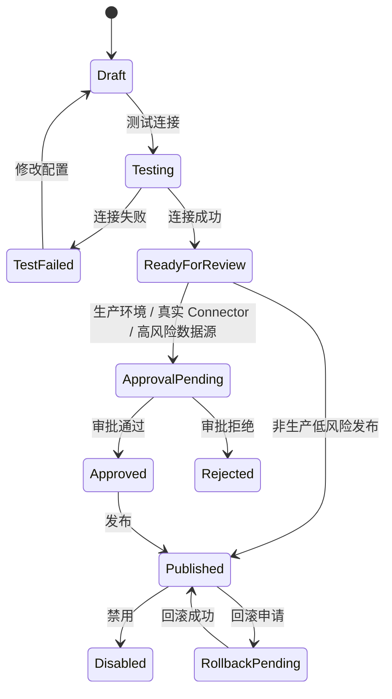

## 5. DataTool Registry 页面

### 5.1 页面目标

注册和管理 Agent 可以调用的工具，配置工具入参出参、风险等级、是否需要 Plan Mode、调用权限和模型上下文边界。

页面必须让用户清楚看到：

- 工具是否只读。
- 工具是否可能产生破坏性操作。
- 工具是否允许结果进入模型上下文。
- 工具被哪些 Agent、Workflow、Policy 和 Release 引用。

### 5.2 页面字段

| 字段 | 类型 | 必填 | 说明 |
|---|---|---|---|
| `tool_id` | string | 是 | 工具 ID |
| `tool_name` | string | 是 | 工具唯一名 |
| `display_name` | string | 是 | 展示名称 |
| `tool_type` | enum | 是 | metadata_query / metric_query / sql_query / quality_check / lineage_query / permission_check / masking / workflow / scheduler |
| `description` | text | 否 | 工具说明 |
| `connector_ids` | string[] | 否 | 关联 Connector |
| `data_source_ids` | string[] | 否 | 关联 DataSource |
| `input_schema_ref` | string | 是 | 入参 Schema 引用 |
| `output_schema_ref` | string | 是 | 出参 Schema 引用 |
| `sample_input` | json | 否 | 示例入参，不含敏感值 |
| `sample_output` | json | 否 | 示例出参，必须脱敏 |
| `risk_level` | enum | 是 | G1 / G2 / G3 / G4 / G5 |
| `is_read_only` | boolean | 是 | 是否只读 |
| `is_destructive` | boolean | 是 | 是否破坏性 |
| `requires_plan_mode` | boolean | 是 | 是否需要 Plan Mode |
| `requires_approval` | boolean | 是 | 是否需要审批 |
| `allow_in_model_context` | boolean | 是 | 结果是否允许进入模型上下文 |
| `max_rows` | number | 否 | 最大返回行数 |
| `max_bytes` | number | 否 | 最大返回字节数 |
| `allowed_roles` | string[] | 否 | 可调用角色 |
| `blocked_roles` | string[] | 否 | 禁止调用角色 |
| `status` | enum | 是 | draft / active / disabled / archived |
| `version` | string | 是 | 配置版本 |

### 5.3 按钮

| 按钮 | 行为 | 风险控制 |
|---|---|---|
| `注册工具` | 新建 DataTool 草稿 | 默认 disabled |
| `编辑 Schema` | 配置入参和出参字段 | Schema 变更需影响分析 |
| `校验 Schema` | 校验示例入参与出参 | 不执行真实工具 |
| `配置风险等级` | 设置 G1 - G5 | G4 / G5 强制 Plan Mode 或 DENY |
| `配置 Plan Mode` | 设置是否进入计划审批 | 高风险默认开启 |
| `配置调用权限` | 跳转或内联编辑 ToolPolicy | 放宽权限需审批 |
| `查看调用记录` | 跳转工具调用观测 | 只读 |
| `提交审批` | 高风险工具或权限放宽提交审批 | 必填变更原因、影响范围、回滚方案 |
| `发布` | 发布工具配置 | 门禁通过后可发布 |
| `回滚` | 回滚工具版本 | 生成回滚发布单 |
| `停用工具` | 停用工具 | 生产停用需影响分析 |

### 5.4 表格列

| 列 | 说明 |
|---|---|
| `tool_name` | 工具名 |
| `tool_type` | 工具类型 |
| `risk_level` | 风险等级 |
| `is_read_only` | 是否只读 |
| `requires_plan_mode` | 是否需要 Plan Mode |
| `requires_approval` | 是否需要审批 |
| `allow_in_model_context` | 是否允许进模型上下文 |
| `connector_count` | 关联 Connector 数 |
| `policy_count` | 关联策略数 |
| `last_called_at` | 最近调用时间 |
| `status` | 状态 |
| `version` | 版本 |

### 5.5 状态流转

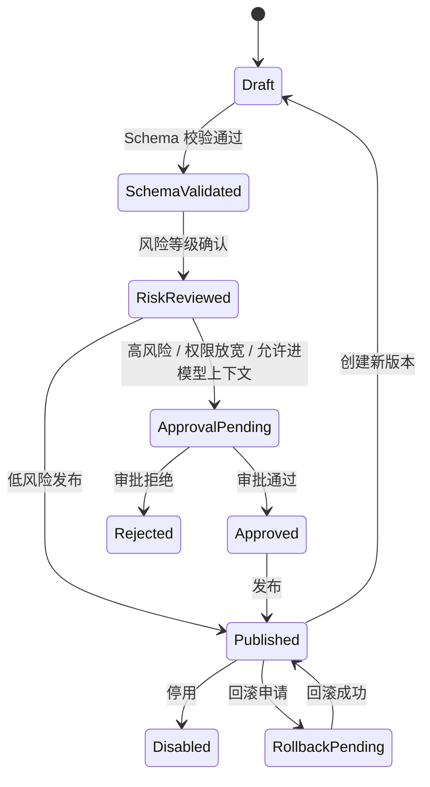

## 6. Policy Engine 页面

### 6.1 页面目标

配置 Runtime 的权限裁决规则，包括 RBAC / ABAC、数据域权限、敏感等级权限、行列权限和审批策略。

页面必须支撑：

- 默认拒绝。
- 规则优先级。
- Allow / Ask / Deny 裁决。
- 命中原因可解释。
- 高风险放宽必须审批。
- 版本可对比、可回滚。

### 6.2 页面分区

| 分区 | 目标 |
|---|---|
| RBAC / ABAC | 配置角色、属性、业务域、环境和任务类型匹配规则 |
| 数据域权限 | 配置业务域、数据源、Schema、Table 的访问范围 |
| 敏感等级权限 | 配置 L1 - L5 数据访问裁决 |
| 行列权限 | 配置行过滤、列屏蔽、字段级拒绝和动态条件 |
| 审批策略 | 配置 ASK、Plan Mode、审批人、SLA 和回滚要求 |
| 命中模拟 | 输入用户、角色、任务、工具和资产，模拟 Policy 裁决 |

### 6.3 页面字段

| 字段 | 类型 | 必填 | 说明 |
|---|---|---|---|
| `policy_id` | string | 是 | 策略 ID |
| `name` | string | 是 | 策略名称 |
| `effect` | enum | 是 | ALLOW / ASK / DENY |
| `priority` | number | 是 | 数字越小优先级越高 |
| `match_roles` | string[] | 否 | RBAC 角色 |
| `match_user_attributes` | object | 否 | ABAC 条件，如部门、岗位、区域 |
| `match_task_types` | string[] | 否 | 任务类型 |
| `match_tool_ids` | string[] | 否 | DataTool 范围 |
| `match_environment_ids` | string[] | 否 | 环境范围 |
| `match_data_domain_ids` | string[] | 否 | 数据域 |
| `match_data_source_ids` | string[] | 否 | 数据源 |
| `match_asset_patterns` | string[] | 否 | 表 / 字段资产模式 |
| `match_sensitivity_levels` | enum[] | 否 | L1 - L5 |
| `row_filter_expression` | string | 否 | 行权限表达式 |
| `column_allowlist` | string[] | 否 | 允许列 |
| `column_denylist` | string[] | 否 | 禁止列 |
| `approval_policy_id` | string | 否 | ASK 时关联审批策略 |
| `reason_template` | text | 是 | 命中原因模板 |
| `valid_from` | datetime | 否 | 生效时间 |
| `valid_to` | datetime | 否 | 失效时间 |
| `status` | enum | 是 | draft / active / disabled / archived |
| `version` | string | 是 | 版本 |

#### 审批策略字段

| 字段 | 类型 | 必填 | 说明 |
|---|---|---|---|
| `approval_type` | enum | 是 | tool_execution / sql_query / policy_change / connector_enable / release / plan_mode |
| `risk_levels` | enum[] | 是 | G1 - G5 |
| `required_approver_roles` | string[] | 是 | 审批角色 |
| `required_approver_ids` | string[] | 否 | 指定审批人 |
| `min_approvals` | number | 是 | 最少审批数 |
| `sla_hours` | number | 否 | SLA |
| `rollback_required` | boolean | 是 | 是否必须回滚方案 |
| `allowed_after_approval_tool_ids` | string[] | 否 | 审批后允许工具白名单 |
| `g5_approval_allowed` | boolean | 是 | G5 是否可审批，默认 false |

### 6.4 按钮

| 按钮 | 行为 | 风险控制 |
|---|---|---|
| `新增策略` | 创建 Policy 草稿 | 默认不发布 |
| `复制策略` | 从既有策略复制 | 保留来源版本 |
| `命中模拟` | 模拟 Allow / Ask / Deny | 不执行工具 |
| `查看命中日志` | 跳转 Policy 裁决日志 | 只读 |
| `禁用策略` | 停用策略 | 生产环境需审批 |
| `提交审批` | 提交高风险策略变更 | 必须影响分析和回滚方案 |
| `发布` | 发布策略版本 | 需要审批和门禁 |
| `版本对比` | 对比当前版本与草稿 | 只读 |
| `回滚` | 回滚到历史版本 | 生成回滚发布单 |

### 6.5 表格列

| 列 | 说明 |
|---|---|
| `priority` | 优先级 |
| `name` | 策略名称 |
| `effect` | ALLOW / ASK / DENY |
| `scope` | 角色、业务域、工具、资产摘要 |
| `sensitivity_levels` | 敏感等级 |
| `approval_policy` | 关联审批策略 |
| `last_matched_at` | 最近命中 |
| `match_count_24h` | 24 小时命中次数 |
| `owner` | 负责人 |
| `status` | 状态 |
| `version` | 版本 |

### 6.6 状态流转

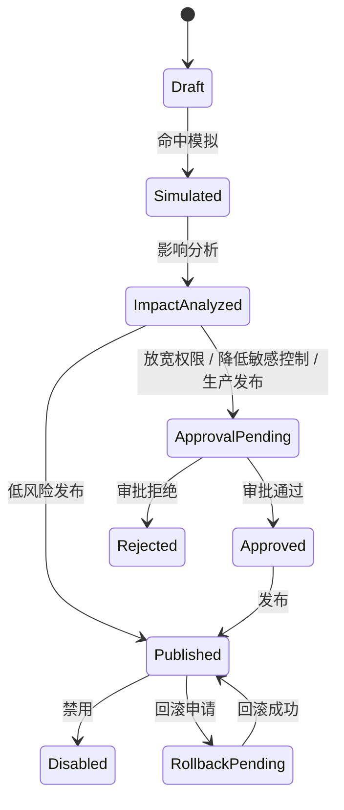

## 7. SQL Gateway 页面

### 7.1 页面目标

配置和调试 SQL Gateway 的安全审查能力，包括 SQL Dry Run、Explain、最大扫描量、超时限制、禁止 DDL / DML、查询结果行数限制。

页面分为两类能力：

- 调试类：Dry Run、Explain、风险识别，只读或非生产可用。
- 配置类：SQLGatewayPolicy、扫描量、超时、LIMIT、禁止规则，发布后生效。

### 7.2 页面字段

| 字段 | 类型 | 必填 | 说明 |
|---|---|---|---|
| `policy_id` | string | 是 | SQL Gateway 策略 ID |
| `name` | string | 是 | 策略名称 |
| `environment_ids` | string[] | 是 | 生效环境 |
| `data_source_ids` | string[] | 否 | 生效数据源 |
| `risk_types` | enum[] | 是 | SELECT_STAR / NO_LIMIT / DDL_DETECTED / DML_DETECTED / SENSITIVE_COLUMN / RAW_LAYER_ACCESS / CROSS_DOMAIN_JOIN / LARGE_RESULT_RISK / UNKNOWN_TABLE / UNSAFE_FUNCTION |
| `decision` | enum | 是 | ALLOW / ASK / DENY |
| `default_limit` | number | 否 | 自动补 LIMIT |
| `max_limit` | number | 否 | 查询结果最大行数 |
| `max_scan_rows` | number | 否 | 最大扫描行数 |
| `max_scan_bytes` | number | 否 | 最大扫描字节 |
| `timeout_seconds` | number | 是 | 查询超时 |
| `allow_explain` | boolean | 是 | 是否允许 Explain |
| `allow_dry_run` | boolean | 是 | 是否允许 Dry Run |
| `allow_rewrite` | boolean | 是 | 是否允许安全改写 |
| `block_ddl` | boolean | 是 | 是否禁止 DDL |
| `block_dml` | boolean | 是 | 是否禁止 DML |
| `requires_approval` | boolean | 是 | 是否需要审批 |
| `approval_policy_id` | string | 否 | 审批策略 |
| `reason` | text | 是 | 策略说明 |
| `status` | enum | 是 | draft / active / disabled / archived |
| `version` | string | 是 | 版本 |

#### SQL Dry Run 输入字段

| 字段 | 类型 | 说明 |
|---|---|---|
| `environment_id` | select | 调试环境 |
| `data_source_id` | select | 数据源 |
| `user_role` | select | 模拟角色 |
| `task_type` | select | 任务类型 |
| `sql_text` | textarea | SQL 文本；页面不保存原文，只保存 hash 和摘要 |

#### SQL Dry Run 输出字段

| 字段 | 类型 | 说明 |
|---|---|---|
| `sql_hash` | string | SQL hash |
| `detected_risks` | enum[] | 命中风险 |
| `decision` | enum | ALLOW / ASK / DENY |
| `rewritten_sql_summary` | text | 改写摘要，不展示敏感明细 |
| `required_approval` | boolean | 是否需要审批 |
| `estimated_scan_rows` | number | 估算扫描行数 |
| `estimated_scan_bytes` | number | 估算扫描字节 |
| `estimated_result_rows` | number | 估算结果行数 |
| `explain_summary` | text | Explain 摘要 |
| `audit_event_id` | string | 审计事件 ID |

### 7.3 按钮

| 按钮 | 行为 | 风险控制 |
|---|---|---|
| `SQL Dry Run` | 风险识别、裁决、估算扫描量 | 不执行真实查询 |
| `Explain` | 获取执行计划摘要 | 只显示安全摘要 |
| `格式化 SQL` | 前端格式化输入 SQL | 不保存 |
| `新增规则` | 创建 SQLGatewayPolicy 草稿 | 默认不生效 |
| `启用禁止 DDL / DML` | 打开 DDL / DML 阻断 | 低风险，可草稿发布 |
| `调整最大扫描量` | 修改扫描上限 | 放宽上限需审批 |
| `调整超时限制` | 修改 timeout | 放宽需审批 |
| `调整结果行数限制` | 修改 max_limit | 放宽需审批 |
| `查看拦截日志` | 跳转 SQL 审查日志 | 只读 |
| `提交审批` | 提交高风险 SQL 策略变更 | 必填原因、影响范围、回滚方案 |
| `发布` | 发布策略 | 门禁通过 |
| `回滚` | 回滚策略版本 | 生成回滚发布单 |

### 7.4 表格列

| 列 | 说明 |
|---|---|
| `name` | 策略名称 |
| `environment` | 环境 |
| `data_sources` | 数据源范围 |
| `risk_types` | 风险类型 |
| `decision` | ALLOW / ASK / DENY |
| `default_limit` | 默认 LIMIT |
| `max_scan_rows` | 最大扫描行 |
| `timeout_seconds` | 超时 |
| `block_ddl` | 禁止 DDL |
| `block_dml` | 禁止 DML |
| `requires_approval` | 是否审批 |
| `last_matched_at` | 最近命中 |
| `status` | 状态 |
| `version` | 版本 |

### 7.5 状态流转

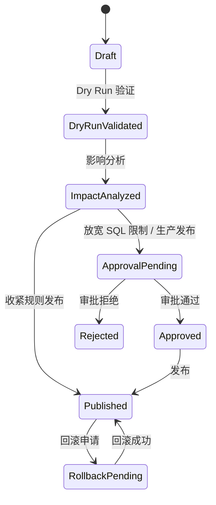

## 8. DLP / Masking 页面

### 8.1 页面目标

管理敏感字段标签、脱敏规则、展示层动态脱敏和导出限制，确保敏感数据不会进入模型上下文、Memory、审计原文或未授权前端展示。

页面应同时支持：

- 字段标签配置。
- 脱敏规则配置。
- 展示层动态脱敏。
- 导出限制。
- DLP 命中日志跳转。

### 8.2 页面字段

#### 敏感字段标签字段

| 字段 | 类型 | 必填 | 说明 |
|---|---|---|---|
| `tag_id` | string | 是 | 标签 ID |
| `field_pattern` | string | 是 | 字段匹配规则 |
| `business_domain_id` | string | 否 | 业务域 |
| `data_source_ids` | string[] | 否 | 数据源范围 |
| `asset_patterns` | string[] | 否 | 表 / 字段资产模式 |
| `sensitivity_level` | enum | 是 | L1 / L2 / L3 / L4 / L5 |
| `data_category` | enum | 是 | personal / finance / business_secret / operational / public / 待确认 |
| `allow_in_model_context` | boolean | 是 | 是否允许进入模型上下文 |
| `allow_in_memory` | boolean | 是 | 是否允许进入 Memory |
| `audit_required` | boolean | 是 | 是否必须审计 |
| `owner_ids` | user[] | 否 | 负责人 |

#### 脱敏规则字段

| 字段 | 类型 | 必填 | 说明 |
|---|---|---|---|
| `masking_rule_id` | string | 是 | 脱敏规则 ID |
| `masking_type` | enum | 是 | full_mask / partial_mask / hash / tokenize / redact / bucket |
| `pattern` | string | 否 | 正则或字段模式 |
| `replacement` | string | 否 | 替换文本 |
| `preserve_format` | boolean | 是 | 是否保留格式 |
| `applies_to_levels` | enum[] | 是 | L2 - L5 |
| `dynamic_by_role` | boolean | 是 | 是否按角色动态脱敏 |
| `role_overrides` | object | 否 | 角色级脱敏覆盖 |
| `allow_export` | boolean | 是 | 是否允许导出 |
| `export_max_rows` | number | 否 | 最大导出行数 |
| `allow_reverse` | boolean | 是 | 是否可逆；默认 false |
| `secret_ref` | string | 条件必填 | 可逆脱敏密钥引用，不保存明文 |

### 8.3 按钮

| 按钮 | 行为 | 风险控制 |
|---|---|---|
| `新增敏感标签` | 创建字段标签草稿 | 默认不放宽 |
| `批量导入标签` | 从元数据或 CSV 导入标签 | 导入前预览，导入后草稿 |
| `新增脱敏规则` | 创建 MaskingRule 草稿 | 默认 mask |
| `测试脱敏` | 用示例值查看脱敏结果 | 示例值不写审计原文 |
| `配置动态脱敏` | 按角色 / 环境设置展示差异 | 放宽展示需审批 |
| `配置导出限制` | 设置是否允许导出和导出行数 | 放宽导出需审批 |
| `查看命中日志` | 跳转 DLP / Masking 日志 | 只读 |
| `提交审批` | 降级敏感等级、取消脱敏、允许导出 | 必填原因、影响范围、回滚方案 |
| `发布` | 发布 DLP / Masking 配置 | 门禁通过 |
| `回滚` | 回滚配置版本 | 生成回滚发布单 |

### 8.4 表格列

#### 敏感字段标签表

| 列 | 说明 |
|---|---|
| `field_pattern` | 字段匹配 |
| `business_domain` | 业务域 |
| `data_sources` | 数据源 |
| `sensitivity_level` | 敏感等级 |
| `data_category` | 数据类别 |
| `allow_in_model_context` | 是否允许进模型上下文 |
| `allow_in_memory` | 是否允许进 Memory |
| `masking_rule` | 默认脱敏规则 |
| `last_hit_at` | 最近命中 |
| `status` | 状态 |
| `version` | 版本 |

#### 脱敏规则表

| 列 | 说明 |
|---|---|
| `masking_type` | 脱敏类型 |
| `applies_to_levels` | 适用敏感等级 |
| `preserve_format` | 是否保留格式 |
| `dynamic_by_role` | 是否动态脱敏 |
| `allow_export` | 是否允许导出 |
| `export_max_rows` | 最大导出行数 |
| `allow_reverse` | 是否可逆 |
| `secret_ref_status` | 密钥引用状态，不展示密钥 |
| `status` | 状态 |
| `version` | 版本 |

### 8.5 状态流转

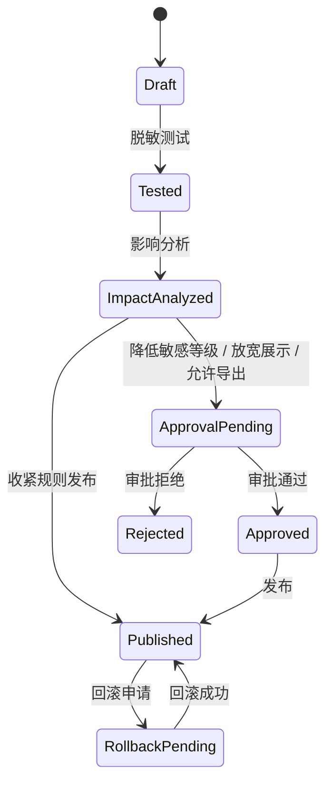

## 9. Audit 页面

### 9.1 页面目标

提供不可绕过的审计查询入口，覆盖用户、Agent、工具、SQL、权限判断、脱敏结果、审批记录。

Audit 页面只读为主，不承担策略编辑。任何审计保留期、导出策略或审计写入配置变更，应进入发布中心或系统设置。

### 9.2 查询字段

| 字段 | 类型 | 说明 |
|---|---|---|
| `time_range` | date_range | 时间范围 |
| `environment_id` | select | 环境 |
| `event_type` | multi_select | 事件类型 |
| `user_id` | select / input | 用户 |
| `agent_app_id` | select | Agent |
| `tool_id` | select | 工具 |
| `data_source_id` | select | 数据源 |
| `policy_decision` | multi_select | ALLOW / ASK / DENY |
| `approval_status` | multi_select | pending / approved / rejected / expired / canceled |
| `sql_hash` | input | SQL hash |
| `request_hash` | input | 请求 hash |
| `result_hash` | input | 结果 hash |
| `trace_id` | input | Trace |
| `task_id` | input | 任务 |
| `severity` | multi_select | info / warning / critical |

### 9.3 审计详情字段

| 字段 | 说明 |
|---|---|
| `event_id` | 审计事件 ID |
| `occurred_at` | 发生时间 |
| `event_type` | 事件类型 |
| `actor` | 操作人或系统账号 |
| `role` | 操作角色 |
| `agent_app` | Agent |
| `task_id` | 任务 |
| `tool` | 工具 |
| `data_sources` | 数据源 |
| `sql_hash` | SQL hash，不展示原始敏感 SQL |
| `policy_decision` | 策略裁决 |
| `policy_reason` | 命中原因 |
| `dlp_result` | 脱敏 / 阻断摘要 |
| `approval_record` | 审批记录 |
| `request_hash` | 请求摘要 |
| `result_hash` | 结果摘要 |
| `raw_payload_allowed` | 默认 false |
| `previous_hash` | 上一审计记录 hash，用于链路校验 |
| `record_hash` | 当前记录 hash |

### 9.4 按钮

| 按钮 | 行为 | 风险控制 |
|---|---|---|
| `查询` | 按条件查询审计事件 | 只读 |
| `重置筛选` | 清空筛选 | 只读 |
| `查看 Trace` | 跳转 Trace / Run 观测 | 只读 |
| `查看策略` | 跳转 Policy 详情 | 只读或按权限编辑 |
| `查看 SQL 审查` | 跳转 SQL 审查日志 | 只读 |
| `查看脱敏记录` | 跳转 DLP / Masking 日志 | 只读 |
| `查看审批记录` | 打开审批详情 | 只读 |
| `导出摘要` | 导出安全摘要 | 不导出原始 payload、结果集、凭证、敏感字段原值 |
| `校验审计链` | 校验 hash 链路完整性 | 只读 |
| `标记复核` | 标记需要人工复核 | 写入新的审计事件 |

### 9.5 表格列

| 列 | 说明 |
|---|---|
| `occurred_at` | 时间 |
| `event_type` | 事件类型 |
| `actor` | 用户 |
| `agent_app` | Agent |
| `tool_name` | 工具 |
| `data_source` | 数据源 |
| `sql_hash` | SQL hash |
| `policy_decision` | 权限判断 |
| `dlp_action` | 脱敏结果 |
| `approval_status` | 审批状态 |
| `request_hash` | 请求摘要 |
| `result_hash` | 结果摘要 |
| `severity` | 严重等级 |
| `record_hash_status` | 审计链校验状态 |

### 9.6 状态流转

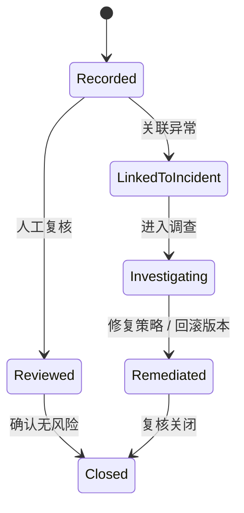

## 10. 关键交互流程

### 10.1 新增 StarRocks 只读数据源

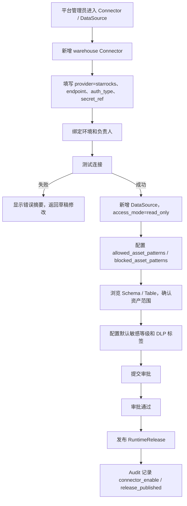

设计理由：

- 只读账号配置在 DataSource 上，通过 `secret_ref` 引用密钥。
- 测试连接只返回状态和摘要，避免凭证明文或数据库错误明细泄露。
- 生产真实 Connector 启用必须审批和发布。

### 10.2 注册高风险 DataTool

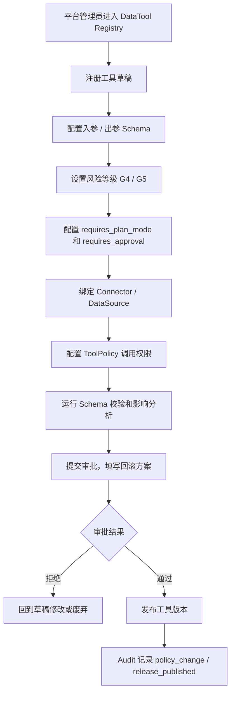

关键控制：

- G4 默认 ASK，必须 Plan Mode。
- G5 默认 DENY，不允许通过审批绕过。
- 工具结果允许进入模型上下文属于高风险变更。

### 10.3 SQL Dry Run 与策略发布

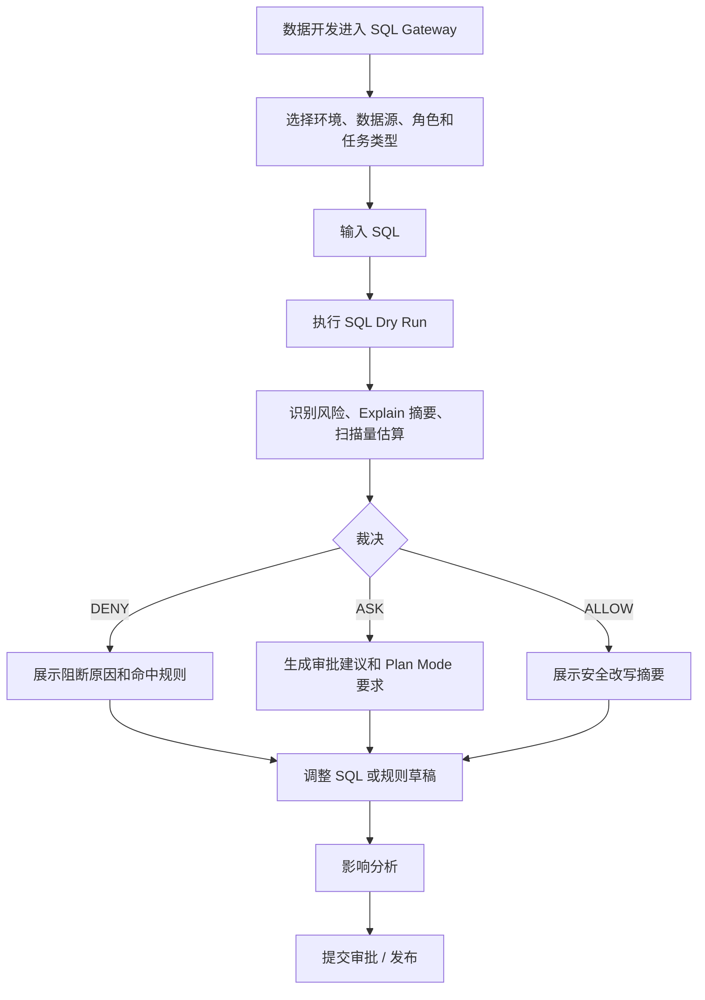

关键控制：

- Dry Run 不执行真实查询。
- SQL 原文不进入审计原文，只保存 hash 和安全摘要。
- 放宽扫描量、超时、结果行数、DDL / DML 限制必须审批。

### 10.4 DLP 降级或取消脱敏

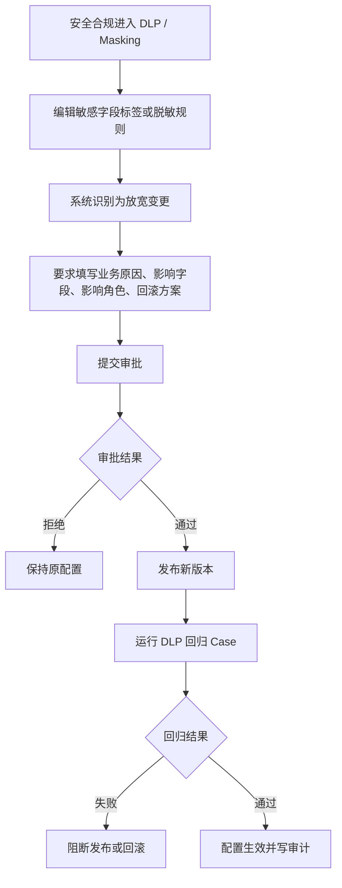

关键控制：

- 降低敏感等级、允许进模型上下文、允许导出都属于高风险配置。
- 可逆脱敏只能保存 `secret_ref`。
- 任何导出只能导出脱敏摘要，不能导出敏感原值。

### 10.5 从异常到回滚

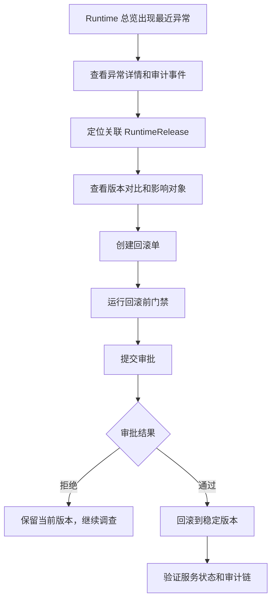

关键控制：

- 回滚不是前端直接切换版本，必须生成发布单。
- 回滚也要写审计，保留原因、审批人、版本和影响范围。

## 11. 高保真前端实现建议

### 11.1 整体信息密度

- Runtime 配置中心是运维型 B 端工具，不做营销式大卡片首页。
- 页面应采用左侧一级导航、顶部环境与版本切换、主体双栏或三栏布局。
- 列表页保持高信息密度：筛选条、表格、详情抽屉、版本侧栏。
- 详情页固定展示对象状态、环境、版本、审批状态和最近审计事件。

### 11.2 Runtime 总览页

- 顶部使用环境切换、时间范围、当前 RuntimeRelease 版本。
- 指标卡片只保留关键数字和趋势，不堆叠过多说明文字。
- 服务状态用组件拓扑条展示：Policy、DataTool、SQL Gateway、DLP、Audit、Connector。
- 最近异常表默认按严重等级和时间排序。
- 待审批任务以紧凑列表展示 SLA、风险等级和审批类型。

### 11.3 Connector / DataSource 页面

- 左侧 Connector 列表按环境、类型、健康状态筛选。
- 详情页使用 Tabs：基本信息、认证、数据源、Schema / Table、健康检查、版本记录、审计。
- `secret_ref` 输入框只显示引用名和校验状态，不提供“查看密钥”。
- Schema / Table 浏览使用可折叠树 + 表格混合模式，便于从库到表再到字段。
- read_only、is_mock、enabled 用 Toggle，但生产环境切换应先进入确认和审批流程。

### 11.4 DataTool Registry 页面

- 工具列表使用风险等级、只读、Plan Mode、审批、模型上下文五个醒目的状态列。
- 工具详情用结构化 Schema 编辑器展示入参出参，不建议用纯文本大框作为主入口。
- 示例输入输出必须提供“脱敏检查”提示。
- 关联关系用侧栏展示：Connector、DataSource、ToolPolicy、AgentApp、AnalysisWorkflow、Release。
- G4 / G5 工具在页面顶部显示风险横幅，说明审批、Plan Mode 和 DENY 边界。

### 11.5 Policy Engine 页面

- 策略列表按优先级排序，并固定显示 effect、scope、sensitivity、approval_policy。
- 规则编辑器分成“匹配条件”“裁决结果”“审批与回滚”“命中原因”四段。
- 命中模拟器应在右侧常驻，用户编辑规则时可即时模拟。
- ALLOW 放宽、ASK 改 ALLOW、DENY 改 ASK / ALLOW 时，用风险变更提示条阻止直接发布。
- 版本对比用左右 Diff，突出 effect、scope、sensitivity、row / column 权限变化。

### 11.6 SQL Gateway 页面

- SQL Dry Run 面板与策略列表分屏展示：左侧 SQL 输入与模拟条件，右侧风险识别结果。
- Dry Run 结果用分段结果卡展示：裁决、风险、扫描量、Explain 摘要、命中规则。
- DDL / DML、SELECT *、NO LIMIT、敏感字段命中使用醒目标签。
- 不在页面持久展示完整历史 SQL 原文；历史查询只显示 hash、摘要和审计引用。
- 查询限制配置用数值输入和单位展示，避免用户误把 rows、bytes、seconds 混淆。

### 11.7 DLP / Masking 页面

- 敏感标签和脱敏规则分为两个主 Tab。
- 字段标签表支持按业务域、数据源、敏感等级、是否允许进模型上下文筛选。
- 脱敏测试提供“示例输入 -> 脱敏输出”的小型预览，但不保存示例敏感原文。
- 角色动态脱敏用矩阵表呈现：角色为行、敏感等级为列、脱敏策略为单元格。
- 导出限制应在同一页面可见，避免只配置展示脱敏却遗漏导出风险。

### 11.8 Audit 页面

- 审计页面首屏应是筛选器 + 审计表格，不做图表优先。
- 详情抽屉展示事件链：用户请求、工具请求、Policy 裁决、SQL 审查、DLP、审批、结果返回。
- Hash 链校验状态用图标和文字状态展示。
- 导出按钮只导出安全摘要，并在导出前展示字段清单。
- 审计事件中所有 raw payload、凭证、敏感原值默认不可见。

## 12. 高风险配置统一控制

### 12.1 高风险变更类型

| 变更类型 | 风险说明 | 必须控制 |
|---|---|---|
| 启用生产真实 Connector | 可能接触生产系统 | 审批、发布、审计、回滚 |
| 数据源从 read_only 改为 read_write / admin | 放宽数据访问能力 | 默认禁止；如企业例外必须审批 |
| DataTool 从只读改为非只读 | 可能执行变更类操作 | Plan Mode、审批、审计、回滚 |
| 允许工具结果进入模型上下文 | 可能泄露敏感数据 | DLP 复核、审批、回归 |
| Policy 从 DENY / ASK 改为 ALLOW | 放宽权限边界 | 影响分析、审批、版本对比 |
| 提高 SQL 扫描量、超时或结果行数 | 扩大数据暴露和资源风险 | 审批、门禁、审计 |
| 放开 DDL / DML | 可能修改生产数据 | 默认 DENY，G5 不可审批 |
| 降低敏感等级或取消脱敏 | 可能泄露敏感数据 | 安全审批、DLP 回归、回滚 |
| 允许导出敏感数据 | 合规风险 | 默认禁止，必须审批和审计 |

### 12.2 统一变更状态

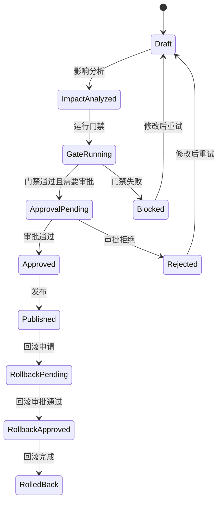

### 12.3 发布前门禁

| 门禁项 | 说明 |
|---|---|
| Policy 回归 | 验证 ALLOW / ASK / DENY 与预期一致 |
| SQL Gateway 回归 | 验证 SELECT *、DDL、DML、敏感字段、大结果集等规则 |
| DLP 回归 | 验证敏感字段识别、脱敏和模型上下文阻断 |
| DataTool Schema 校验 | 验证入参出参 Schema 和示例脱敏 |
| Connector 健康检查 | 验证连接状态，但不暴露凭证明文 |
| 安全红队 | 验证越权、绕过脱敏、关闭审计、绕过 SQL Gateway |
| 审批完整性 | 验证审批人、SLA、回滚方案、审批结论 |
| 审计写入 | 验证变更过程、发布过程和回滚过程均可审计 |

## 13. 风险与后续任务

| 风险 / 待确认 | 影响 | 后续任务 |
|---|---|---|
| 企业 IAM / SSO / 用户属性来源待确认 | ABAC 条件无法最终落地 | API 契约阶段定义用户上下文字段 |
| 审批系统待确认 | Plan Mode 只能先设计审批对象和状态 | API 契约阶段定义审批创建、回调和撤销 |
| Connector 真实健康检查协议待确认 | 测试连接无法统一返回结构 | Connector API 契约中定义健康检查响应 |
| SQL Explain 格式因引擎不同而不同 | 前端 Explain 展示可能不统一 | 按 StarRocks / Doris / Hive 定义适配摘要 |
| DLP 标签来源待确认 | 标签可能来自元数据平台、人工配置或扫描器 | 后续定义标签同步和冲突处理 |
| 审计导出合规要求待确认 | 导出字段范围需要法务或安全确认 | 设计导出字段白名单和审批策略 |

## 14. 阶段 3 交付边界

本文件完成 Runtime 配置页面的产品设计，包括：

- 页面目标。
- 字段。
- 按钮。
- 表格列。
- 状态流转。
- 关键交互流程。
- 高保真前端实现建议。
- 高风险配置的审批、版本和回滚控制。

下一阶段建议进入 `Data&QA 产品配置页面设计`，输出 `docs/product/04-dataqa-pages.md`，覆盖 Agent 产品、场景与意图、语义层、主动澄清、查询规划、结果解释、知识库、反馈与 Bad Case。
