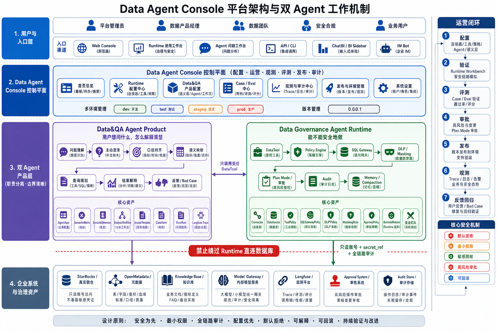
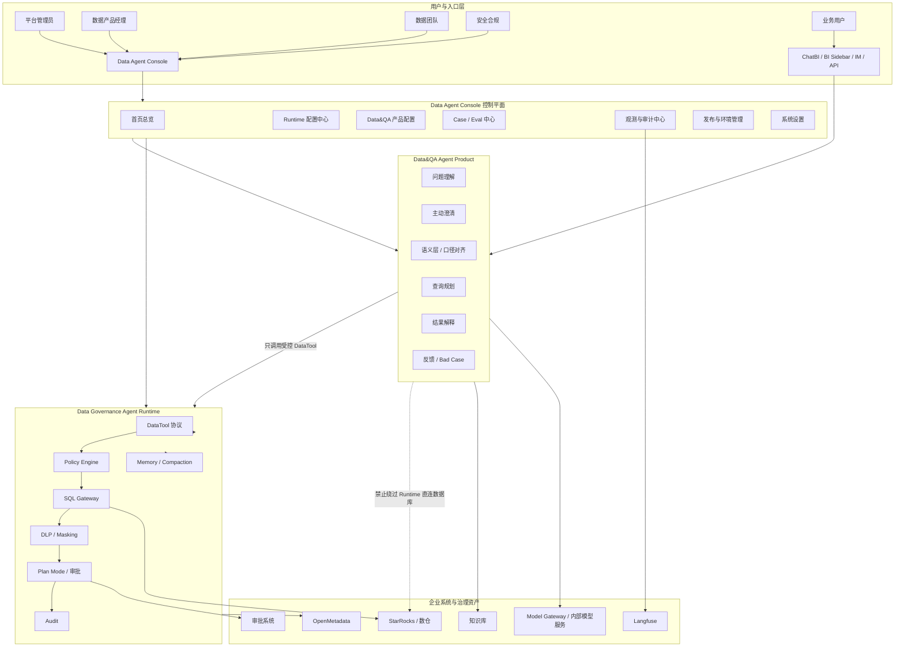

# Data Agent Console 产品介绍报告

版本：0.00.1  
范围：Data Agent Console、Data Governance Agent Runtime、Data&QA Agent Product  
当前状态：前端 MVP + Mock API + 确定性 Runtime / Data&QA 编排  



## 1. 产品摘要

Data Agent Console 是面向企业数据平台的 Agent 控制台，用于统一配置、使用、运营、观测、评测和发布两个 Agent 产品：

- Data Governance Agent Runtime：企业级安全治理运行时底座，回答“能不能安全地做”。
- Data&QA Agent Product：上层数据问答与分析产品，回答“用户想问什么、怎么解释清楚”。

它不是一个单纯的聊天窗口，也不是只管理表单的后台配置系统，而是一个面向企业数据 Agent 生命周期的控制平面和使用工作台。

核心价值是：把自然语言问数、数据治理任务、安全策略、工具调用、SQL 审查、DLP 脱敏、审批、审计、Case / Eval、发布和 Bad Case 回归放到同一个可运营闭环中。

## 2. 产品定位

### 2.1 一句话定位

Data Agent Console 是企业内部 Data Agent 的统一控制台，用于让数据团队安全地配置 Agent，让业务用户可信地使用 Agent，让管理者可观测、可评测、可审计地运营 Agent。

### 2.2 三层定位

| 层级 | 产品对象 | 核心问题 | 典型能力 |
| --- | --- | --- | --- |
| 使用层 | Runtime Workbench / Agent Workspace | 用户如何真正使用两个 Agent | 安全模拟、治理作业、RMA 问数、Trace、反馈 |
| 控制层 | Data Agent Console | 如何配置、评测、发布和运营 Agent | 配置中心、审批中心、发布中心、Case / Eval、审计 |
| 运行层 | Data Governance Agent Runtime | Agent 能不能安全地执行 | Policy、DataTool、SQL Gateway、DLP、Audit、Plan Mode |

### 2.3 非目标范围

当前阶段不承诺：

- 不直接连接真实生产数据库。
- 不保存明文数据库账号、Token、手机号、邮箱、地址或密码。
- 不让 Data&QA Product 绕过 Runtime 直接访问数据库。
- 不把 LLM 当成唯一大脑或唯一安全边界。
- 不做模型训练平台、通用 BI 平台或通用工单系统。

## 3. 用户与场景

### 3.1 目标用户

| 用户 | 主要诉求 | 使用入口 |
| --- | --- | --- |
| 平台管理员 | 接入数据源、管理环境、发布 Runtime、排查服务状态 | Runtime 配置中心、Runtime 工作台、发布中心 |
| 数据产品经理 | 配置 RMA 问数助手、维护语义层、优化体验 | Data&QA 产品配置、Agent 问数工作台、Bad Case 工作台 |
| 数据团队 | 管理指标口径、Case、Eval、Trace，判断是否可上线 | 语义层、Case / Eval、Trace / Audit |
| 安全合规 | 审批高风险配置、查看审计、验证脱敏和权限 | 策略引擎、DLP / Masking、审批中心、审计 |
| 业务用户 | 提问、看答案、看解释、反馈结果是否可信 | Agent 问数工作台、未来 ChatBI / IM / BI Sidebar |

### 3.2 核心场景

1. 平台管理员接入 StarRocks 只读数据源，并配置 SQL Gateway、DLP 和审批策略。
2. 数据产品经理配置 RMA 问数助手，绑定 Runtime 环境、数据源、语义层、知识库、工具集和答案模板。
3. 数据团队用 Case / Eval 验证 Agent 是否可上线。
4. 安全合规通过 Runtime Workbench 模拟高风险 SQL、PII 导出、DDL / DML 等风险链路。
5. 业务用户在 Agent 问数工作台提出 RMA 问题，系统展示理解、澄清、语义映射、执行计划、答案、Trace 和反馈。
6. 负反馈进入 Bad Case，关联 Trace、语义层、Policy、Prompt / Skill、Case，并进入回归评测。

## 4. 总体架构



## 5. 两个 Agent 产品边界

### 5.1 Data Governance Agent Runtime

Runtime 是安全治理运行时底座，负责所有“执行前、执行中、执行后”的控制。

主要职责：

- Policy Engine：判断工具调用、SQL、数据访问是 ALLOW、ASK 还是 DENY。
- DataTool 协议：把所有外部能力封装成可治理、可审计、可评测的工具。
- SQL Gateway：SQL Dry Run、Explain、风险识别、最大扫描量、超时、行数限制、DDL / DML 拦截。
- DLP / Masking：敏感字段识别、动态脱敏、导出限制、模型上下文限制。
- Audit：记录用户、Agent、工具、SQL、权限判断、脱敏结果、审批记录。
- Plan Mode / 审批：高风险操作先生成计划，审批后才能执行。
- Connector：隔离真实系统连接，不允许产品层直接访问数据库或第三方系统。
- Memory / Compaction：管理上下文、记忆、敏感信息压缩和泄露防护。
- 安全红队测试：验证 prompt injection、越权、脱敏绕过、SQL 风险。
- 治理任务执行：支持敏感字段识别、质量规则建议、权限巡检等治理任务。

Runtime 的原则：

- 默认拒绝。
- 最小权限。
- 只读优先。
- 高风险必须审批。
- 所有执行必须审计。
- 敏感数据不能明文进入模型上下文。

### 5.2 Data&QA Agent Product

Data&QA 是面向用户体验的问数与分析产品，负责让用户问题变成可信答案。

主要职责：

- 用户问题理解。
- 主动澄清。
- 指标、维度、时间口径对齐。
- 语义层映射。
- 查询规划。
- 数据分析。
- 结果解释。
- 业务建议。
- 用户反馈。
- Case 数据集。
- Langfuse 观测与评测。
- 面向管理者、数据团队、运营团队的差异化答案体验。

Data&QA 的原则：

- 先理解，再对口径。
- 先澄清，再执行。
- 先经过 Runtime，再访问数据。
- 只基于受治理结果回答。
- 不展示未经授权的明细数据。
- 负反馈必须进入 Bad Case 和 Eval 回归。

### 5.3 关键边界

Data&QA Product 不能绕过 Runtime 直接访问数据库、Connector 或生产系统。

正确链路：

```text
用户问题
  -> Data&QA Agent Product
  -> 语义层 / 查询计划
  -> Runtime DataTool
  -> Policy Engine
  -> SQL Gateway
  -> DLP / Masking
  -> Audit
  -> 可信答案
```

错误链路：

```text
用户问题
  -> Data&QA Agent Product
  -> 直接生成 SQL
  -> 直接访问生产数据库
```

第二条链路必须被架构、权限和代码同时禁止。

## 6. Data Agent Console 功能总览

### 6.1 首页总览

首页用于呈现跨 Runtime、Data&QA、Eval、发布和审计的运营态势。

核心内容：

- 今日最重要 3 件事。
- 待审批任务。
- Eval 阻断项。
- Bad Case 数量。
- Runtime 健康状态。
- RMA 问数产品状态。
- 用户角色相关工作流。
- 下一步推荐。

### 6.2 Runtime 使用工作台

Runtime Workbench 是直接使用 Data Governance Agent Runtime 的工作台。

包含两个 Tab：

| Tab | 目的 | 核心能力 |
| --- | --- | --- |
| 安全链路模拟器 | 验证一次 SQL 或工具调用如何被治理链路裁决 | Policy、SQL Gateway、DLP、Plan Mode、Audit |
| 治理作业台 | 执行自动化治理任务 | 敏感字段识别、质量规则建议、审批卡、审计引用 |

典型样例：

- 安全查询：普通 RMA 指标查询。
- 高风险 SQL：SELECT *、大扫描、缺少 Limit。
- PII 导出：手机号、邮箱、地址等敏感字段。
- DDL / DML 红队：delete、drop、update 等破坏性操作。

### 6.3 Agent 问数工作台

Agent Workspace 是 Data&QA Agent Product 的使用入口，首版以 RMA 问数为主线。

核心流程：

```text
输入问题
  -> 问题理解
  -> 澄清状态
  -> 语义映射
  -> 执行计划
  -> 最终回答
  -> Trace
  -> 反馈 / Bad Case
```

展示内容：

- 任务类型。
- 任务等级。
- 指标。
- 维度。
- 时间范围。
- 权限裁决。
- 工具序列。
- SQL 摘要。
- 风险检查点。
- 指标口径。
- 数据来源。
- 限制说明。
- 业务建议。
- 审计引用。

### 6.4 Runtime 配置中心

Runtime 配置中心用于配置安全执行底座。

页面包括：

- Runtime 总览。
- Connector / DataSource。
- DataTool Registry。
- Policy Engine。
- SQL Gateway。
- DLP / Masking。
- Approval Center。

高风险 Runtime 配置必须具备：

- 草稿。
- 版本。
- 审批。
- 发布。
- 回滚。
- 审计。

### 6.5 Data&QA 产品配置

Data&QA 产品配置用于配置面向用户的问数产品能力。

页面包括：

- Agent 应用。
- Semantic Layer。
- Analysis Workflow。
- Task Type。
- Clarification Template。
- Answer Template。
- Knowledge Source。

RMA 问数助手需要绑定：

- Runtime 环境。
- 只读数据源。
- 语义层。
- 知识库。
- 受控工具集。
- Case / Eval。
- 答案模板。

### 6.6 Case / Eval 中心

Case / Eval 是 Agent 能否上线的质量门禁。

核心对象：

- CaseItem。
- EvalRun。
- EvalSuite。
- ScoringRule。
- BadCase。

核心评分维度：

- SQL 执行成功率。
- 数值准确率。
- 工具调用合法率。
- 意图识别准确率。
- 口径一致性。
- 结论可信度。
- 用户采纳率。
- 拒答正确率。

### 6.7 观测与审计中心

观测与审计中心用于追踪每一次 Agent 运行。

Trace 内容：

- 用户问题。
- 任务识别结果。
- 澄清过程。
- 语义映射。
- 工具调用。
- SQL。
- 权限判断。
- DLP 结果。
- 最终回答。
- 用户反馈。

审计内容：

- 用户。
- Agent。
- 工具。
- SQL。
- Policy 判断。
- 脱敏结果。
- 审批记录。
- 发布记录。

### 6.8 发布与环境管理

发布中心用于管理 Runtime 和 Data&QA 的版本生命周期。

环境：

- dev：开发验证。
- test：测试验证。
- staging：上线前预发验证。
- prod：生产使用。

发布对象：

- RuntimeRelease。
- ProductRelease。
- Policy Bundle。
- Semantic Layer。
- AgentApp。
- Case Suite。

发布前检查：

- 配置完整性。
- Eval 通过率。
- 安全红队通过率。
- 高风险审批完成。
- 环境差异对比。
- 回滚版本可用。

## 7. 运行机制

### 7.1 问数运行机制

以“本月 RMA 客诉率是多少？”为例：

1. 用户在 Agent 问数工作台输入问题。
2. Data&QA 识别任务类型为 L1 查询取数。
3. 系统识别指标为 RMA 客诉率。
4. 系统识别时间为本月。
5. 语义层校验指标口径、维度和时间字段。
6. 查询规划生成工具序列和 SQL 摘要。
7. Data&QA 调用 Runtime DataTool。
8. Runtime 执行 Policy 判断。
9. SQL Gateway 审查 SQL。
10. DLP / Masking 处理结果。
11. Audit 写入审计。
12. Data&QA 基于安全结果生成答案。
13. 用户反馈满意或不满意。
14. 不满意进入 Bad Case，并可进入 Eval 回归。

### 7.2 高风险 SQL 机制

以“导出所有退货客户手机号”为例：

1. Data&QA 识别为敏感明细导出请求。
2. 语义层标记涉及客户手机号等敏感字段。
3. Runtime Policy 判断为 DENY 或 ASK。
4. SQL Gateway 阻止未授权明细查询。
5. DLP 阻止明文敏感字段返回。
6. Audit 记录拒答和风险原因。
7. Data&QA 给出拒答说明和可替代建议。

### 7.3 治理任务机制

以“帮我识别 RMA 域敏感字段”为例：

1. 用户在 Runtime 治理作业台输入治理任务。
2. Runtime 识别任务类型和风险等级。
3. DataTool 调用元数据、字段画像、敏感分类能力。
4. Policy 判断是否可执行。
5. 高风险任务触发 Plan Mode。
6. 审批通过后执行或生成建议。
7. 输出敏感标签、脱敏规则和审计引用。

## 8. 当前 MVP 实现状态

当前平台已经实现：

- React + TypeScript 前端 MVP。
- 左侧导航 + 顶部环境切换 + 设置面板。
- 中文 / 英文切换。
- Runtime 使用工作台。
- Agent 问数工作台。
- Dashboard 角色化工作流。
- Connector / DataSource 配置。
- DataTool Registry。
- Policy Engine。
- SQL Gateway。
- DLP / Masking。
- Approval Center。
- Agent Apps。
- Semantic Layer。
- Analysis Workflow。
- Case Library。
- Eval Runs。
- Bad Case Workbench。
- Trace / Audit Logs。
- Release Center。
- 本地 mock state。
- Mock API 调用。
- 前端 lint / typecheck / test / build 验证。

当前后端能力：

- 确定性 Runtime 编排。
- 确定性 Data&QA Orchestrator。
- Mock DataTool。
- Mock SQL Gateway。
- Mock DLP / Masking。
- Mock Audit。
- Mock Plan Mode。
- Mock Eval / Bad Case。

当前未实现：

- 未接真实 StarRocks 或生产数仓。
- 未接真实大模型或内部 Model Gateway。
- 未接真实 Langfuse 项目。
- 未接真实审批系统。
- 未做真实租户级环境隔离。
- 未把配置写入生产级配置中心或数据库。

## 9. 从 MVP 到真实 ChatBI 的路线

### 9.1 真实数仓接入

需要完成：

- StarRocks 只读账号。
- secret_ref 凭证管理。
- Connector 健康检查。
- Schema / Table 白名单。
- SQL Gateway 真实 Explain。
- 查询超时和扫描量控制。
- 查询结果脱敏。
- 全链路审计。

### 9.2 真实语义层

需要完成：

- RMA 指标字典。
- 维度字典。
- 时间口径字典。
- 同义词。
- 枚举值。
- 指标公式。
- 表字段映射。
- SQL 模板。
- 口径冲突规则。

### 9.3 大模型或内部模型服务

如果选择接模型，建议通过企业内部 Model Gateway。

模型适合负责：

- 意图理解。
- 澄清问题生成。
- 问题改写。
- 答案解释。
- 异常原因候选分析。
- 业务建议表达。

模型不应该直接负责：

- 直接访问数据库。
- 自由执行 SQL。
- 判断最终权限。
- 决定敏感数据是否可展示。
- 绕过 Runtime 安全链路。

### 9.4 Eval 上线门禁

上线前至少需要：

- 30 到 50 条 RMA 核心 Case。
- 10 条以上安全红队 Case。
- 指标准确性验证。
- SQL 合法性验证。
- 拒答正确性验证。
- Bad Case 回归。
- 生产发布审批。

## 10. 产品优势

### 10.1 相比普通 ChatBI

普通 ChatBI 往往关注自然语言转 SQL 和答案展示，Data Agent Console 进一步补齐了：

- 安全治理。
- 审批。
- 审计。
- DLP。
- Case / Eval。
- 发布回滚。
- Bad Case 闭环。
- Runtime / Product 分层。

### 10.2 相比普通配置后台

普通配置后台只管理对象，Data Agent Console 同时提供真实使用工作台：

- Runtime Workbench 让治理团队直接验证安全链路。
- Agent Workspace 让业务用户体验问数流程。
- Trace / Audit 让数据团队追踪运行过程。
- Bad Case Workbench 让产品持续改进。

### 10.3 相比只接大模型

只接大模型无法天然解决企业数据安全和可信问数问题。Data Agent Console 强调：

- 大模型负责理解和表达。
- 语义层负责口径。
- Runtime 负责安全执行。
- Eval 负责上线门禁。
- Audit 负责可追溯。

## 11. 关键风险

| 风险 | 表现 | 控制措施 |
| --- | --- | --- |
| 数据越权 | 用户看到无权限数据 | RBAC / ABAC、行列权限、默认拒绝 |
| SQL 风险 | 大扫描、DDL / DML、SELECT * | SQL Gateway、Dry Run、Explain、限制规则 |
| 敏感数据泄露 | 手机号、邮箱、地址进入答案或模型上下文 | DLP、Masking、模型上下文限制 |
| 口径错误 | 指标公式或时间口径不一致 | 语义层、Case、Eval、指标负责人 |
| 模型幻觉 | 编造原因、编造数据、编造 SQL | 结构化输出、证据约束、答案模板、Trace |
| 发布风险 | 未评测配置进入生产 | 发布门禁、审批、回滚 |
| Bad Case 无闭环 | 失败问题反复出现 | Bad Case 工作台、归因、回归 Eval |

## 12. 推荐演示路径

### 路径一：平台管理员安全接入

1. 打开首页总览。
2. 进入 Connector / DataSource。
3. 查看 StarRocks RMA 只读源。
4. 进入 DataTool Registry。
5. 查看 query_sql 工具。
6. 进入 Policy Engine。
7. 查看默认拒绝和高风险 ASK / DENY。
8. 进入 SQL Gateway。
9. 查看 DDL / DML、SELECT *、敏感字段规则。
10. 进入 Runtime 工作台，运行安全模拟。

### 路径二：数据产品经理配置 RMA 问数

1. 进入 Agent Apps。
2. 查看 RMA 问数助手。
3. 进入 Semantic Layer。
4. 查看 RMA 客诉率、维度和时间口径。
5. 进入 Analysis Workflow。
6. 查看“先理解、先对口径、再执行、再回答”流程。
7. 进入 Agent 问数工作台。
8. 输入“本月 RMA 客诉率是多少？”。
9. 查看问题理解、执行计划、答案和 Trace。
10. 提交反馈或转 Bad Case。

### 路径三：数据团队上线验证

1. 进入 Case Library。
2. 查看黄金 Case、澄清 Case、安全 Case。
3. 进入 Eval Runs。
4. 运行 RMA release gate。
5. 查看通过率和失败分布。
6. 进入 Trace / Audit。
7. 定位失败节点。
8. 进入 Bad Case Workbench。
9. 归因并关联语义层、Policy 或答案模板。
10. 回归通过后进入 Release Center 发布。

## 13. 后续路线图

### 阶段 1：真实 Runtime 接入

- 接 StarRocks 只读数据源。
- 接 OpenMetadata。
- 接真实 SQL Explain。
- 接真实审计存储。
- 完成 DLP / Masking 规则落地。

### 阶段 2：真实 Data&QA 问数

- 建 RMA 语义层。
- 支持真实指标查询。
- 支持澄清交互。
- 支持多轮上下文。
- 接内部 Model Gateway 或规则型问数增强。

### 阶段 3：评测与发布门禁

- 建 RMA Case Suite。
- 接 Langfuse。
- 打通 Eval Run。
- 增加 Bad Case 回归。
- 发布中心接真实审批。

### 阶段 4：多入口扩展

- ChatBI / BI Sidebar。
- Feishu / WeCom / Slack Bot。
- API / CLI。
- 管理者日报。
- 数据团队诊断台。

## 14. 结论

Data Agent Console 的核心不是“再做一个聊天窗口”，而是为企业数据 Agent 建立一套可配置、可使用、可观测、可评测、可发布、可审计的控制平面。

Data&QA Agent Product 让用户能用自然语言完成问数、解释和分析；Data Governance Agent Runtime 保证所有工具调用、SQL、数据访问和高风险操作都在安全治理边界内完成。

当前版本已经具备产品原型和 mock 运行闭环。下一阶段的重点不是继续堆配置页，而是接入真实只读数仓、真实语义层、真实观测和上线门禁，让 RMA 问数助手从演示型 MVP 走向可灰度试用的企业 ChatBI Agent。
